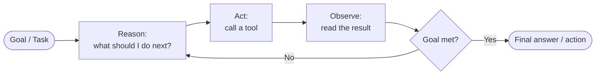
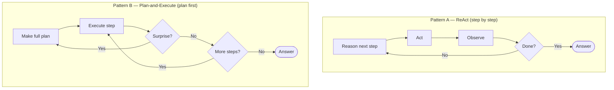
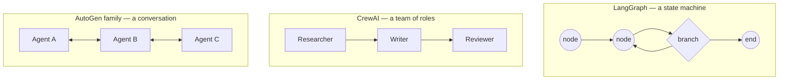
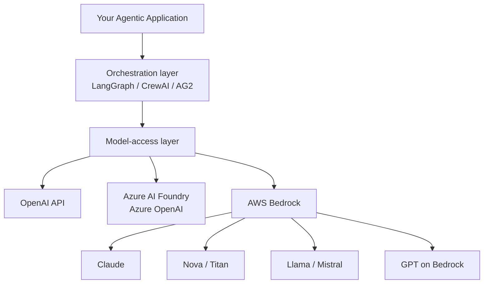
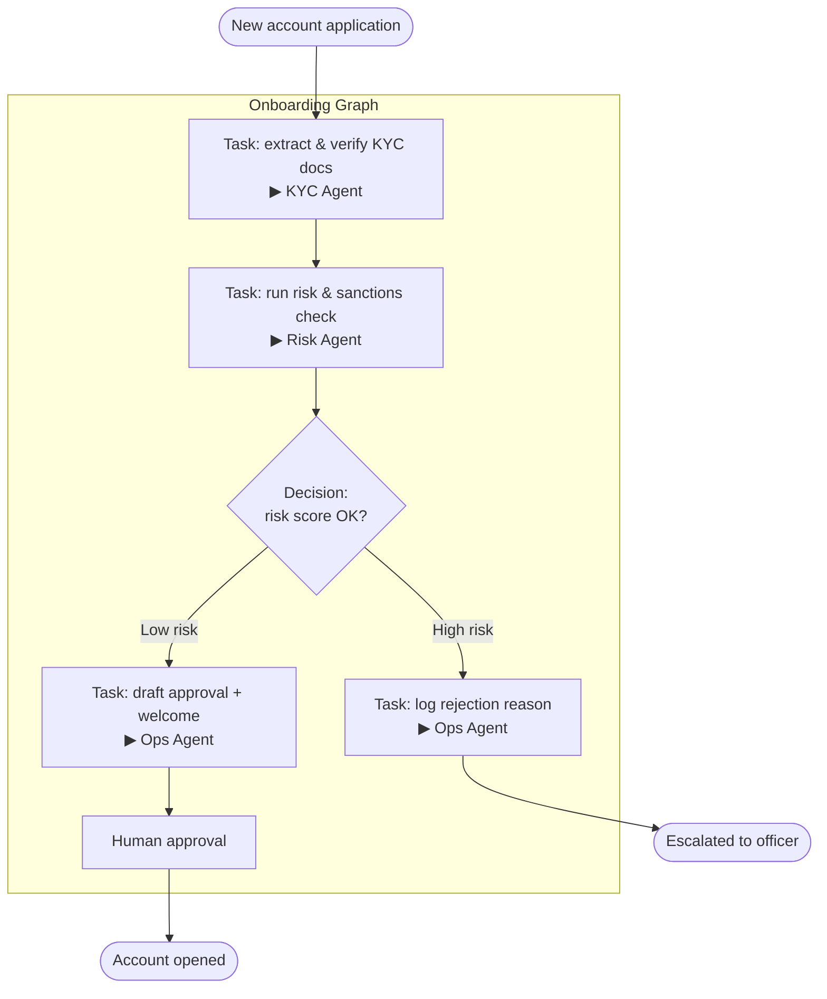
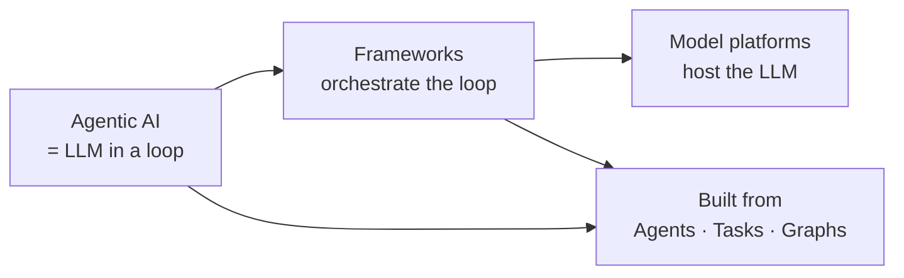

# Section 1 — Introduction to Agentic AI & the LLM Ecosystem

> **Audience:** Software professionals who already understand GenAI basics (prompts, LLMs, embeddings, RAG).
> **Goal of this section:** Move the group from "LLM that answers" to "system that acts" — and give them a shared vocabulary (Agents, Tasks, Graphs) plus a clear map of the framework and platform choices they'll face on the job.
> **Format:** Concept → real example → use case → diagram. Domain context throughout is Indian BFSI and Healthtech, so it stays concrete.

---

## How this connects to what you already know

You already know an LLM call: prompt in, text out. Stateless, one shot. RAG added retrieval before the prompt. Function calling let the model *request* a tool.

Agentic AI is the next step: the model stops being a single function call and becomes the **decision-maker inside a loop** — it plans, calls tools, looks at what came back, and decides the next move on its own, repeating until the goal is met.

Everything in this section builds on that one shift: **from answering to pursuing a goal.**

---

## Topic 1 — What is Agentic AI?

### The core idea

A plain LLM **responds**. An agent **pursues a goal**. The difference is the loop.

An agentic system runs a cycle: **Reason → Act (use a tool) → Observe the result → Decide → repeat** until the goal is done or it gives up. The LLM is the "brain" that decides; tools are its "hands"; memory is its notepad.



This loop is what people mean by "ReAct" (Reason + Act). It is the atom of every agent framework you'll see later.

### Plain LLM vs Agent — the honest comparison

| | Plain LLM call | Agentic system |
|---|---|---|
| Input | One prompt | A goal + tools + memory |
| Steps | One | Many (loops until done) |
| Tools | None (or one function call you wire up) | Chooses tools itself, in sequence |
| State | Stateless | Remembers across steps |
| Failure handling | Returns whatever it got | Can retry, re-plan, ask a human |
| Good for | Q&A, summarize, classify | Multi-step work with decisions |

### Real-time example — Loan eligibility agent (Indian retail bank)

**Without agents (what most teams ship first):**
A single prompt — *"Given this applicant's data, are they eligible for a personal loan?"* The LLM guesses from whatever text you pasted. No live bureau score, no policy check. Confidently wrong.

**With an agent:** the goal is *"Decide eligibility for this personal loan application, per bank policy."* The agent then runs a loop:

1. **Reason:** "I need the applicant's credit score first."
2. **Act:** calls the CIBIL / bureau tool → **Observe:** score = 710.
3. **Reason:** "Above the 700 cut-off. Now check income-to-EMI ratio."
4. **Act:** calls the income-verification tool → **Observe:** FOIR = 42%.
5. **Reason:** "Policy caps FOIR at 50%. Now check for existing NPA flags."
6. **Act:** calls the internal core-banking tool → **Observe:** no defaults.
7. **Decide:** eligible, recommend ₹5,00,000 at the standard rate, and produce a reason trail for the credit officer.

The point: **no single prompt could do this.** The agent decided *which* checks to run, *in what order*, and *stopped* when it had enough. That decision-making inside the loop is Agentic AI.

### The autonomy spectrum (set expectations early)

Agentic ≠ fully autonomous. It's a dial:

```
Assisted ────────► Supervised ────────► Autonomous
(suggests,         (acts, but a         (acts end-to-end,
 human acts)        human approves        human only on
                    key steps)            exceptions)
```

In regulated BFSI/health work, you almost always want **Supervised** — the agent does the legwork, a human approves anything irreversible (disbursing money, altering a health record). Keep this dial in mind; it drives every design decision later.

### Use case — Healthtech: patient triage assistant
Goal: *"Route this incoming patient message to the right department."* The agent reads the message, checks symptom severity against a rules tool, looks up the patient's history via a records tool, and either books a routine slot or **escalates to a human nurse** when it sees red-flag symptoms. Same loop, different domain — and note the built-in human handoff for safety.


### How does the agent "reason" — one plan upfront, or step by step?

A fair question the moment you see that loop: *does the agent split the goal into all the steps first, then run them — or does it figure out each step live?* Both patterns exist, and knowing which one you're using matters.

**Pattern A — Step-by-step (ReAct): no upfront plan.**
The agent reasons about *only the next action*, acts, observes, and *then* decides the following step from what it just saw. It does **not** know all the steps in advance. The loan example above is exactly this — notice that step 3 ("check FOIR") is only decided *after* seeing the score was 710. If the score had come back 640, step 3 would instead have been "reject, below cut-off, stop." The next step depends on the last observation, so it *can't* be planned upfront.

**Pattern B — Plan-first (Plan-and-Execute): split upfront, then iterate.**
The agent first breaks the whole goal into a full ordered plan — *"1. get score, 2. check FOIR, 3. check NPA, 4. decide"* — and then executes each step. Good agents can **re-plan** mid-way if a step returns something unexpected.



**The trade-off:**

| | ReAct (step-by-step) | Plan-and-Execute (plan first) |
|---|---|---|
| Planning | None upfront; decides next step live | Full plan generated first |
| Adapts to surprises | Naturally — every step reacts | Needs an explicit re-plan step |
| LLM calls | More (reasons every step) | Fewer (one plan, then execute) |
| Best for | Branchy work where the next step depends on the last result | Well-understood, mostly-linear workflows |
| Risk | Can wander or loop without a goal-check | The plan can go stale if reality differs |

**Which one fits the loan example?** ReAct — because each check *gates* the next. You shouldn't pull the NPA flag if the credit score already disqualified the applicant. A plan-first agent would waste tool calls checking things that no longer matter after an early rejection. Use plan-first instead when the steps are known and mostly linear (e.g. a fixed monthly-report pipeline), where paying for one big plan up front is cheaper than reasoning at every step.

> The `Reason → Act → Observe → Decide` loop drawn earlier in this topic is the **ReAct** shape — the default you'll meet first in every framework.

---

## Topic 2 — Role of LangGraph, AutoGen, CrewAI in the ecosystem

### Why frameworks exist at all

You *could* hand-code the loop from Topic 1 with raw API calls. But you'd also be building: state that survives across steps, retries when a tool fails, checkpoints so a crashed run can resume, human-approval pauses, and coordination when you have more than one agent. That plumbing is weeks of work. **Frameworks give you the plumbing so you focus on the logic.**

The three names people ask about map to three different mental models.



### The three mental models

**LangGraph — "a state graph / state machine."**
You draw the workflow explicitly as nodes and edges. Shared *state* flows between nodes; edges can loop back, branch, or pause for a human. You get checkpointing, streaming, and human-in-the-loop as first-class features. **Pick it when one workflow needs cycles, branching, retries, or an approval step** — i.e. anything regulated. (LangGraph hit its 1.0 stable release in late 2025 and is the most common choice for production stateful workflows.)

**CrewAI — "a team of role-playing specialists."**
You define agents as personas — *Researcher, Writer, Reviewer* — each with tools and a task, working as a "crew." Minimal code, very intuitive. **Pick it when the work splits naturally into roles and you want a working prototype fast.** The trade-off: the abstractions that make it fast can get in your way when you need fine control over edge cases.

**AutoGen — "a conversation between agents."**
The original model was multiple agents *chatting* to solve a problem (great for research and code-execution loops). **Important 2026 status to tell the class:** the original Microsoft AutoGen is now in **maintenance mode**. Its lineage forked two ways — **AG2** (the Apache-2.0 community fork that continues the conversational style) and the **Microsoft Agent Framework (MAF)**, which merged AutoGen + Semantic Kernel into one production SDK (1.0 in April 2026). So if someone starts a *new* Microsoft-stack project, point them at MAF, not classic AutoGen. This is exactly the kind of ecosystem churn a practitioner needs to track.

### Quick comparison

| | LangGraph | CrewAI | AutoGen / AG2 / MAF |
|---|---|---|---|
| Mental model | State graph | Role-based crew | Agent conversation |
| Control | Explicit, fine-grained | High-level, opinionated | Emergent from dialogue |
| Best at | Cycles, branching, HITL, prod | Fast role-based prototypes | Research, code-exec, multi-turn |
| Ease for beginners | Steeper | Easiest | Moderate |
| 2026 note | 1.0, widely used in prod | 1.x, MCP support | Classic AutoGen → maintenance; use AG2 or MAF |

> They're converging, not competing to the death: all three now support **MCP** (Model Context Protocol) for tools, plus streaming and persistence. Real systems increasingly **mix** them.

### Real-time example — same job, three framings

**Job:** generate a monthly BFSI compliance report from raw transaction data.

- **LangGraph framing:** a graph — `ingest → validate → [loop: flag anomalies until clean] → summarize → human approval → publish`. You'd choose this because of the validation loop and the mandatory human sign-off before publishing.
- **CrewAI framing:** a crew — a *Data Analyst* agent pulls and cleans, a *Compliance Writer* drafts the report, a *Reviewer* checks it against policy. Fast to stand up for a demo.
- **AutoGen/AG2 framing:** an *Analyst* agent and a *Critic* agent converse — Analyst drafts, Critic pokes holes, they iterate until the Critic is satisfied. Good when you want that back-and-forth refinement.

Same business outcome, three different shapes. **The framework is a means, not the goal** — teach the group to pick by the shape of the problem, not by hype.

### Use case — One-line rule of thumb for the class
> Needs strict control and approvals → **LangGraph.** Maps cleanly to a team of roles → **CrewAI.** Centered on conversational back-and-forth or Microsoft stack → **AG2 / MAF.**

---

## Topic 3 — OpenAI vs Azure OpenAI vs AWS Bedrock

### First, kill the confusion

These are **not** frameworks. LangGraph/CrewAI/AutoGen are the *orchestration* layer (how agents run). OpenAI/Azure/Bedrock are the **model-access layer** (where the actual LLM lives and how you call it). Your agent framework sits **on top of** one of these.



### The three options

**OpenAI (direct API).**
You call OpenAI's own endpoint for GPT-family models. Fastest access to their newest models, simplest to start. The catch for enterprises: your data leaves for OpenAI's infrastructure, and governance/compliance is on you. Fine for prototypes and consumer apps; harder to clear with a bank's legal team.

**Azure OpenAI (now branded Azure AI Foundry).**
The *same* OpenAI models, but served inside Microsoft Azure with enterprise controls — your Azure tenancy, Entra ID identity, private networking, regional deployment, Microsoft's compliance certifications. **Pick it when the org is Microsoft-native** and legal has already blessed Azure. The OpenAI partnership means GPT-family models land here early.

**AWS Bedrock.**
A **multi-model gateway**: one API, one IAM security model, one bill — and access to *many* model families: Anthropic Claude, Amazon Nova/Titan, Meta Llama, Mistral, Cohere, AI21, DeepSeek, Stability, and — since April 2026 — **OpenAI's GPT models too**. Data stays inside your AWS VPC; prompts don't train the base models. **Pick it when you're AWS-native, want to swap models without rewriting the app, and need AWS's compliance story.**

### Comparison

| | OpenAI direct | Azure AI Foundry | AWS Bedrock |
|---|---|---|---|
| Model choice | GPT family | GPT family (+ some others) | Many families (Claude, Nova, Llama, GPT, …) |
| Governance | You handle it | Azure-native (Entra, Purview) | AWS-native (IAM, CloudTrail) |
| Data residency | OpenAI infra | Your Azure region | Your AWS VPC/region |
| Swap models freely | No | Limited | Yes — same API |
| Best fit | Prototypes, consumer apps | Microsoft-stack enterprises | AWS-stack enterprises, multi-model |
| India note | — | Azure India regions | **Mumbai region** available |

### Real-time example — Why an Indian bank picks Bedrock (Mumbai)

A Chennai-based bank wants an agentic KYC-review system. Requirements from the compliance team:

1. **Data residency** — customer PII must stay in India → Bedrock in the **Mumbai region** keeps data in-country. ✔
2. **DPDP Act alignment** — data stays in the VPC, prompts don't train base models. ✔
3. **No lock-in** — start on Claude for reasoning, but keep the option to route cheap, high-volume checks to a smaller Nova model **without rewriting the app** → single Bedrock API. ✔
4. **Audit trail** — every model call logged via CloudTrail for the regulator. ✔

The same team, if they were Microsoft-native and standardized on GPT with legal already approving Azure, would rationally choose **Azure AI Foundry** instead. **The "right" answer follows the existing cloud, the required model, and the compliance bar — not a leaderboard.** Hammer that home.

### Use case — Cost routing
Not every request needs a frontier model. "What are the branch hours?" → route to a cheap model. "Assess this loan file" → route to Claude Opus / a strong reasoning model. Bedrock's single API makes this routing a config change, not a rewrite. This is a very real lever for controlling GenAI spend in production.

---

## Topic 4 — Foundational concepts: Agents, Tasks, Graphs

This is the vocabulary the rest of the course stands on. Three words, precise meanings.

### Agent
An **agent** = an LLM given a **role**, a set of **tools**, some **memory**, and permission to run the **loop** from Topic 1. It's the actor that decides and acts.

> *Example:* a *KYC-Verification Agent* — role: "verify identity documents"; tools: OCR reader, government-ID validator, internal records lookup; memory: what it's already checked this session.

### Task
A **task** = one unit of work with a clear input and an expected output. It's *what* you want done; the agent is *who* does it. Tasks are how you break a big goal into checkable pieces.

> *Example:* "Extract the PAN number from this uploaded document and confirm it matches the application form." Clear input (the document + form), clear output (match / mismatch + the value).

### Graph
A **graph** = the orchestration structure that wires agents and tasks together. **Nodes** are steps (an agent doing a task, or a decision point). **Edges** are the transitions between them. **State** — the shared data — flows along the edges. Graphs are what let you express order, branching, loops, and approvals.

### How they compose



Read it as a sentence: **agents** perform **tasks**, arranged in a **graph**, with a human approval node before anything irreversible. That's a production agentic system in one picture.

### Real-time example — Healthtech discharge-summary pipeline
Goal: turn a patient's raw clinical notes into a clean discharge summary.

- **Agents:** *Extractor Agent* (pulls diagnoses, meds, vitals), *Summarizer Agent* (writes patient-friendly text), *Safety-Check Agent* (flags drug-interaction risks).
- **Tasks:** "extract structured fields from notes" → "draft the summary" → "check meds against an interaction database."
- **Graph:** `Extract → Summarize → Safety-check → [if risk flagged: route to doctor] → else finalize`.

If the Safety-Check Agent flags a risk, the graph **branches to a human doctor** instead of finalizing. Agents + Tasks + Graph + a human gate — the same four ideas, now instinctive.

### The one-line definitions to leave on the board
> **Agent** = who acts. **Task** = what to do. **Graph** = how it's all wired together, including where a human steps in.

---

## Wrap-up — the mental model to carry forward



1. **Agentic AI** = an LLM that acts in a loop to reach a goal, not just answer.
2. **Frameworks** (LangGraph / CrewAI / AG2·MAF) orchestrate that loop — pick by the *shape* of the problem.
3. **Model platforms** (OpenAI / Azure AI Foundry / Bedrock) host the LLM — pick by *cloud, model, and compliance*.
4. It's all built from three primitives: **Agents, Tasks, Graphs.**

### Discussion prompts (use these to check understanding before Section 2)
- Take a workflow from your own project. Where would a plain LLM call fail, and where does the *loop* add value?
- For that workflow: LangGraph, CrewAI, or AG2/MAF — and why?
- Which model platform fits your org's compliance reality, and what's the one requirement that decides it?
- Draw your workflow as a graph. Where does the **human approval node** belong?
