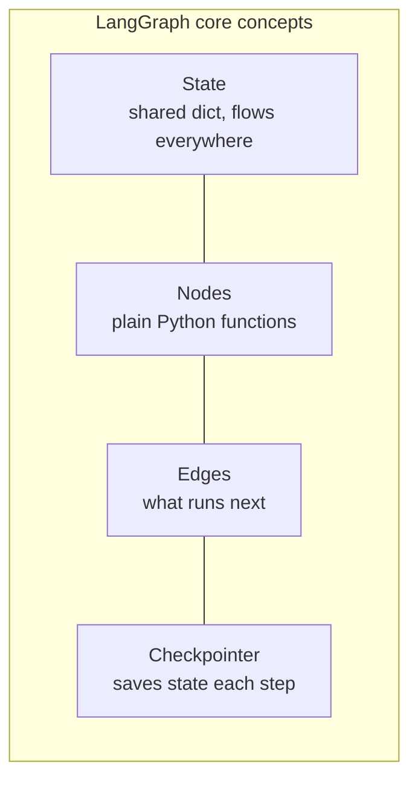
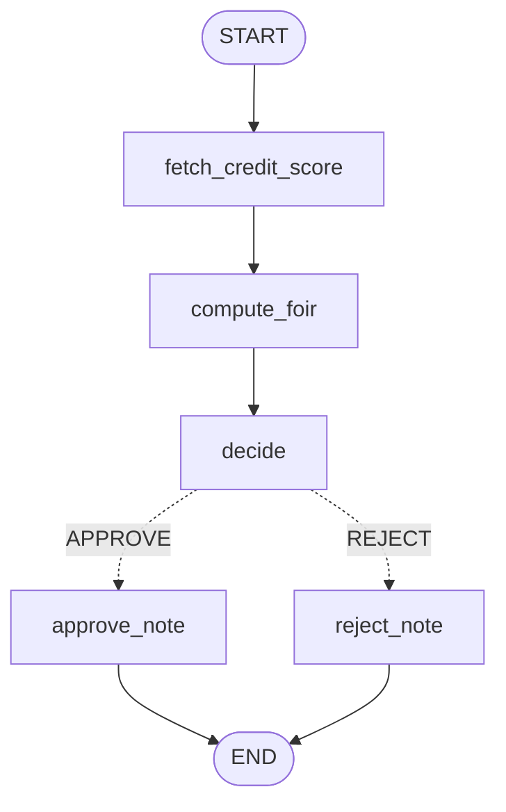
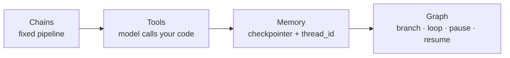

# Section 2 — LangChain Recap, LangGraph Architecture & Your First DAG

> **Audience:** Software professionals with GenAI basics; comfortable with Python.
> **Goal:** Refresh the three LangChain building blocks (Chains, Tools, Memory), understand *why* LangGraph exists as a separate layer, then set up an environment and build a working graph end to end.
> **Every program below is runnable.** All were tested against **LangGraph 1.2.9 / LangChain 1.3.14 / langchain-core 1.5.0**. Programs 1–3 and 5–6 need **no API key** — they use a fake model or plain Python, so the whole room can run them even on locked-down laptops.

---

## ⚠️ Read this first: the v1 reset

If your learners Google "LangChain tutorial", most results will be **wrong**. LangChain and LangGraph both hit **1.0 on 22 Oct 2025**, and it was a rewrite, not a version bump. Put this table on screen early — it saves an hour of debugging:

| You'll see in old tutorials | Status now | Use instead |
|---|---|---|
| `LLMChain`, `ConversationChain` | Moved out of core | `langchain_classic.chains`, or plain LCEL |
| `ConversationBufferMemory` | Moved out of core | LangGraph checkpointer (Program 3) |
| `initialize_agent`, `AgentExecutor` | Deprecated | `create_agent` |
| `from langgraph.prebuilt import create_react_agent` | Deprecated | `from langchain.agents import create_agent` |
| `prompt=` in agent constructor | Renamed | `system_prompt=` |
| `response.text()` | Now a property | `response.text` |
| LCEL (`prompt \| llm \| parser`) | **Not deprecated** — still recommended for chains and RAG | keep using it |

Two more things that changed: model responses now return **typed content blocks** (text, reasoning, tool calls) instead of one opaque string, and **Python 3.10 is the minimum**.

> The single sentence that explains the new architecture: **LangGraph is the runtime; LangChain is an opinionated high-level layer sitting on top of it.** `create_agent` builds a LangGraph graph for you under the hood.

---

# Part A — LangChain recap: Chains, Tools, Memory

## A1. Chains

A **chain** is a fixed, linear pipeline: prompt → model → parse output. No decisions, no loops. You know every step at author time.

LCEL (LangChain Expression Language) composes them with the pipe operator. Each piece is a *Runnable*, so they share one interface — `.invoke()`, `.stream()`, `.batch()` — and the pipe just wires output to input.

### Program 1 — A summarisation chain (no API key)

```python
"""
Program 1: LCEL chain — prompt | model | parser
Run: python 01_chain.py
Uses a fake model so it runs offline. Swap in a real model where marked.
"""
from langchain_core.prompts import ChatPromptTemplate
from langchain_core.output_parsers import StrOutputParser
from langchain_core.language_models.fake_chat_models import FakeListChatModel

# --- the model ---
# OFFLINE (classroom):
model = FakeListChatModel(responses=["Salaried applicant, low risk, eligible for standard rate."])

# REAL (uncomment one, needs credentials):
# from langchain.chat_models import init_chat_model
# model = init_chat_model("openai:gpt-4.1-mini")
# model = init_chat_model("bedrock_converse:<your-model-id>")   # AWS Bedrock

prompt = ChatPromptTemplate.from_template(
    "You are a credit analyst. Summarise this loan note in ONE line:\n\n{note}"
)

chain = prompt | model | StrOutputParser()   # <-- this is LCEL

result = chain.invoke({"note": "Credit score 762, FOIR 33%, no defaults, salaried, 8 yrs experience"})
print(result)
```

**Output:**
```
Salaried applicant, low risk, eligible for standard rate.
```

**The teaching point:** `prompt | model | StrOutputParser()` is three Runnables composed into one. Without the parser you'd get an `AIMessage` object; the parser pulls out the plain string. Ask the group: *where would this chain break?* Answer: the moment you need an "if" — e.g. "if the score is missing, go fetch it." A chain can't branch. That limitation is the whole reason LangGraph exists.

---

## A2. Tools

A **tool** is a Python function the model is allowed to call. The `@tool` decorator turns a function into something the LLM can see and invoke — and the metadata it uses to decide comes from **the function name, the type hints, and the docstring**.

> Drill this: **the docstring is not a comment, it is the prompt the model reads to decide whether to call this tool.** A vague docstring is the single most common cause of "why isn't my agent calling the tool?"

### Program 2 — Defining and inspecting tools (no API key)

```python
"""
Program 2: Tools — definition, auto-generated schema, direct invocation
Run: python 02_tools.py
"""
from langchain_core.tools import tool

@tool
def get_credit_score(pan: str) -> int:
    """Fetch the CIBIL credit score for a customer using their PAN number.
    Use this whenever a credit decision needs a bureau score."""
    fake_bureau = {"ABCDE1234F": 762, "XYZAB9876K": 640}
    return fake_bureau.get(pan, 700)

@tool
def calculate_foir(monthly_income: float, existing_emi: float) -> float:
    """Calculate FOIR (Fixed Obligation to Income Ratio) as a percentage.
    Use this to check whether the applicant's existing EMIs are within bank policy."""
    return round((existing_emi / monthly_income) * 100, 1)

# What the LLM actually "sees":
for t in (get_credit_score, calculate_foir):
    print(f"name   : {t.name}")
    print(f"desc   : {t.description}")
    print(f"schema : {t.args}\n")

# Calling a tool directly (this is what the agent does for you):
print("score:", get_credit_score.invoke({"pan": "ABCDE1234F"}))
print("foir :", calculate_foir.invoke({"monthly_income": 90000, "existing_emi": 30000}))
```

**Output:**
```
name   : get_credit_score
desc   : Fetch the CIBIL credit score for a customer using their PAN number.
         Use this whenever a credit decision needs a bureau score.
schema : {'pan': {'title': 'Pan', 'type': 'string'}}

name   : calculate_foir
...
score: 762
foir : 33.3
```

**Live exercise (2 min):** have them delete the docstring and re-run. The description goes empty — and that's exactly what the model would be given. Point made.

---

## A3. Memory

An LLM call is stateless. **Memory** is whatever you send back so the model appears to remember.

**This is where the biggest v1 change bites.** The old `ConversationBufferMemory` classes are out of core. In the current stack, memory is handled by **LangGraph checkpointers** — you compile a graph with a checkpointer, pass a `thread_id`, and state persists across invocations automatically.

Two levels worth naming:
- **Short-term (thread)** — the conversation so far, scoped to one `thread_id`. Checkpointer.
- **Long-term (cross-thread)** — facts about a user that outlive the session. LangGraph `Store`.

### Program 3 — Memory via checkpointer (no API key)

```python
"""
Program 3: Memory — the modern way, via a LangGraph checkpointer + thread_id
Run: python 03_memory.py
"""
from langgraph.graph import StateGraph, START, END, MessagesState
from langgraph.checkpoint.memory import InMemorySaver
from langchain_core.language_models.fake_chat_models import FakeListChatModel

chat = FakeListChatModel(responses=["Noted, Mani.", "Your name is Mani."])
# REAL: from langchain.chat_models import init_chat_model
#       chat = init_chat_model("openai:gpt-4.1-mini")

def call_model(state: MessagesState) -> dict:
    # state["messages"] already holds the FULL history for this thread
    return {"messages": [chat.invoke(state["messages"])]}

builder = StateGraph(MessagesState)
builder.add_node("model", call_model)
builder.add_edge(START, "model")
builder.add_edge("model", END)

app = builder.compile(checkpointer=InMemorySaver())   # <-- memory switch

config = {"configurable": {"thread_id": "customer-101"}}   # <-- the memory key

app.invoke({"messages": [{"role": "user", "content": "My name is Mani"}]}, config)
result = app.invoke({"messages": [{"role": "user", "content": "What is my name?"}]}, config)

for m in result["messages"]:
    print(f"{m.type:6} | {m.content}")
```

**Output:**
```
human  | My name is Mani
ai     | Noted, Mani.
human  | What is my name?
ai     | Your name is Mani.
```

Note we only *sent* one message the second time, but **four** came back. The checkpointer restored the history. Change `thread_id` to `"customer-999"` and re-run — the memory is gone, because it's a different thread. That's your per-customer session isolation, free.

> **Production note:** `InMemorySaver` dies with the process. For real systems swap in a database-backed checkpointer (Postgres/SQLite) — same API, one line changed.

## A4. Putting the three together

`create_agent` is the v1 one-liner that combines a model + tools + memory into a working ReAct agent:

```python
"""
Program 4: The three concepts combined into one agent. NEEDS AN API KEY.
"""
from langchain.agents import create_agent
from langgraph.checkpoint.memory import InMemorySaver
# reuse get_credit_score and calculate_foir from Program 2

agent = create_agent(
    model="openai:gpt-4.1-mini",          # or "bedrock_converse:<model-id>"
    tools=[get_credit_score, calculate_foir],
    system_prompt=(
        "You are a loan eligibility assistant for an Indian retail bank. "
        "Policy: minimum credit score 700, maximum FOIR 50%. "
        "Always fetch the score and compute FOIR before deciding."
    ),
    checkpointer=InMemorySaver(),
)

config = {"configurable": {"thread_id": "app-9001"}}
out = agent.invoke(
    {"messages": [{"role": "user", "content":
        "PAN ABCDE1234F, monthly income 90000, existing EMI 30000. Eligible?"}]},
    config,
)
print(out["messages"][-1].text)
```

Note there is **no loop code here** — `create_agent` builds the ReAct loop for you. Which raises the obvious question, and the bridge to Part B: *if this one-liner works, why would I ever draw a graph myself?*

---

# Part B — LangGraph architecture and why it matters

## B1. The problem LangGraph solves

Chains are straight lines. Real business processes are not. They have:

- **Branches** — approve / reject / send for manual review
- **Loops** — retry the validation until it passes
- **Human pauses** — nobody disburses ₹5 lakh without an officer clicking approve
- **Failure recovery** — the process ran for 40 seconds, the third API timed out; don't start over
- **Auditability** — the regulator asks *"why was this rejected?"* six months later

`create_agent` gives you a loop, but the LLM decides everything inside it. **Sometimes you don't want the model deciding the control flow** — bank policy decides it. That's a graph.

> **The rule of thumb for the class:** if the LLM should decide the order of steps → agent. If *your business rules* decide the order → graph. Most regulated systems are a graph with agents inside some nodes.

## B2. The four architectural pieces



**1. State** — a `TypedDict` shared by every node. Each node returns a *partial* dict, and LangGraph merges it in. You never pass arguments between nodes manually.

**2. Nodes** — ordinary Python functions with the signature `def node(state) -> dict`. A node can call an LLM, hit a database, or do pure arithmetic. **Nodes are not required to involve AI at all** — this surprises people and is worth saying out loud.

**3. Edges** — the wiring.
- `add_edge("a", "b")` — always go from a to b
- `add_conditional_edges("a", router_fn, {...})` — a function decides where to go next
- `START` / `END` — the entry and exit sentinels

**4. Checkpointer** — persists state after every step. This one component gives you memory, crash-resume, time-travel debugging, and human-in-the-loop pauses. It's the feature that makes LangGraph a *production* runtime rather than a flowchart library.

## B3. Why this matters — the honest trade-off

| | `create_agent` (LangChain) | Hand-built graph (LangGraph) |
|---|---|---|
| Lines of code | ~10 | ~50 |
| Who controls the order | The LLM | You |
| Determinism | Varies per run | Same every run |
| Auditability | Read the trace | The graph *is* the policy document |
| Best for | Open-ended tasks, research, chat | Regulated workflows, fixed policy |

Don't oversell graphs. **Using a graph for a straight line is a mistake** — if there's no branching, no loop and no human pause, a plain LCEL chain is simpler and faster. Don't pay the complexity tax for a pipeline you could draw with one arrow.

---

# Part C — Installation, environment setup, and your first DAG

## C1. Environment setup

```bash
# 1. Python 3.10+ is mandatory
python3 --version

# 2. Isolated environment
python3 -m venv .venv
source .venv/bin/activate          # Windows: .venv\Scripts\activate

# 3. Core install
pip install langgraph langchain

# 4. One model provider (pick what you use)
pip install langchain-openai       # OpenAI / Azure OpenAI
pip install langchain-aws          # AWS Bedrock
pip install langchain-anthropic    # Anthropic direct

# 5. Optional but recommended: tracing
pip install langsmith

# 6. Verify
python -c "import langgraph, langchain; print('ok')"
```

**`.env` file** (never commit this):

```bash
# OpenAI
OPENAI_API_KEY=sk-...

# Azure OpenAI
AZURE_OPENAI_API_KEY=...
AZURE_OPENAI_ENDPOINT=https://<resource>.openai.azure.com/

# AWS Bedrock — prefer an IAM role in production over static keys
AWS_REGION=ap-south-1
AWS_ACCESS_KEY_ID=...
AWS_SECRET_ACCESS_KEY=...

# LangSmith tracing (optional)
LANGSMITH_TRACING=true
LANGSMITH_API_KEY=...
```

Load it with `pip install python-dotenv` and:
```python
from dotenv import load_dotenv
load_dotenv()
```

**Two setup gotchas that will eat classroom time:**
1. **Python 3.9 fails.** All v1 packages need 3.10+.
2. **Old tutorial imports fail.** If someone hits `ImportError` on `ConversationBufferMemory` or `create_react_agent`, they've copied pre-1.0 code. Point them back at the table at the top of this file.

---

## C2. Your first LangGraph DAG

**Use case:** a loan pre-screening workflow. Fetch the bureau score → compute FOIR → apply bank policy → branch to approve or reject. Deterministic, auditable, no LLM needed — which is exactly the point.



### Program 5 — The first DAG (no API key, fully tested)

```python
"""
Program 5: First LangGraph DAG — loan pre-screening
Run: python 05_first_dag.py
No API key needed. Demonstrates State, Nodes, Edges, conditional routing, checkpointer.
"""
from typing import TypedDict, Literal
from langgraph.graph import StateGraph, START, END
from langgraph.checkpoint.memory import InMemorySaver


# ---------- 1. STATE : the shared dict every node reads and writes ----------
class LoanState(TypedDict):
    applicant: str
    monthly_income: float
    emi_outstanding: float
    credit_score: int
    foir: float
    decision: str
    reason: str


# ---------- 2. NODES : plain functions, state in -> partial dict out ----------
def fetch_credit_score(state: LoanState) -> dict:
    """Stand-in for a real CIBIL API call."""
    fake_bureau = {"Ravi Kumar": 762, "Anitha S": 640}
    score = fake_bureau.get(state["applicant"], 700)
    print(f"[fetch_credit_score] score = {score}")
    return {"credit_score": score}          # merged into state


def compute_foir(state: LoanState) -> dict:
    foir = round((state["emi_outstanding"] / state["monthly_income"]) * 100, 1)
    print(f"[compute_foir] FOIR = {foir}%")
    return {"foir": foir}


def decide(state: LoanState) -> dict:
    """Bank policy lives here — deterministic, not LLM-decided."""
    if state["credit_score"] < 700:
        return {"decision": "REJECT",
                "reason": f"Credit score {state['credit_score']} below cut-off 700"}
    if state["foir"] > 50:
        return {"decision": "REJECT",
                "reason": f"FOIR {state['foir']}% exceeds policy cap 50%"}
    return {"decision": "APPROVE",
            "reason": f"Score {state['credit_score']}, FOIR {state['foir']}% within policy"}


def approve_note(state: LoanState) -> dict:
    print(f"[approve_note] {state['applicant']} APPROVED — {state['reason']}")
    return {}


def reject_note(state: LoanState) -> dict:
    print(f"[reject_note] {state['applicant']} REJECTED — {state['reason']}")
    return {}


# ---------- 3. ROUTER : decides which edge to take ----------
def route(state: LoanState) -> Literal["approve_note", "reject_note"]:
    return "approve_note" if state["decision"] == "APPROVE" else "reject_note"


# ---------- 4. BUILD THE GRAPH ----------
builder = StateGraph(LoanState)

builder.add_node("fetch_credit_score", fetch_credit_score)
builder.add_node("compute_foir", compute_foir)
builder.add_node("decide", decide)
builder.add_node("approve_note", approve_note)
builder.add_node("reject_note", reject_note)

builder.add_edge(START, "fetch_credit_score")
builder.add_edge("fetch_credit_score", "compute_foir")
builder.add_edge("compute_foir", "decide")
builder.add_conditional_edges(
    "decide", route,
    {"approve_note": "approve_note", "reject_note": "reject_note"},
)
builder.add_edge("approve_note", END)
builder.add_edge("reject_note", END)

graph = builder.compile(checkpointer=InMemorySaver())


# ---------- 5. RUN IT ----------
applicants = [
    ("Ravi Kumar", 90000, 30000),   # good score, good FOIR  -> APPROVE
    ("Anitha S",   60000, 20000),   # low score              -> REJECT
    ("Meena R",    50000, 30000),   # ok score, FOIR too high-> REJECT
]

for name, income, emi in applicants:
    print("-" * 55)
    out = graph.invoke(
        {"applicant": name, "monthly_income": income, "emi_outstanding": emi},
        config={"configurable": {"thread_id": name}},
    )
    print(f"FINAL: {out['decision']} | {out['reason']}")

# ---------- 6. BONUS: the graph draws itself ----------
print("\n--- Mermaid diagram of this graph ---")
print(graph.get_graph().draw_mermaid())
```

**Actual output:**
```
-------------------------------------------------------
[fetch_credit_score] score = 762
[compute_foir] FOIR = 33.3%
[approve_note] Ravi Kumar APPROVED — Score 762, FOIR 33.3% within policy
FINAL: APPROVE | Score 762, FOIR 33.3% within policy
-------------------------------------------------------
[fetch_credit_score] score = 640
[compute_foir] FOIR = 33.3%
[reject_note] Anitha S REJECTED — Credit score 640 below cut-off 700
FINAL: REJECT | Credit score 640 below cut-off 700
-------------------------------------------------------
[fetch_credit_score] score = 700
[compute_foir] FOIR = 60.0%
[reject_note] Meena R REJECTED — FOIR 60.0% exceeds policy cap 50%
FINAL: REJECT | FOIR 60.0% exceeds policy cap 50%
```

**Three things to call out while this runs:**
1. **Nodes never talk to each other directly.** `compute_foir` reads `credit_score` from state without knowing who put it there. That's what makes nodes independently testable — a real selling point to an enterprise team.
2. **All three applicants take different paths** through the same graph. That's the branching a chain cannot do.
3. **`graph.get_graph().draw_mermaid()`** prints a diagram of your own graph. The architecture doc maintains itself — good line for an audit conversation.

---

## C3. The payoff — add a human approval gate

This is the demo that sells LangGraph. Three extra lines turn the workflow into one that **pauses mid-execution**, waits for a human, and resumes exactly where it stopped.

### Program 6 — Human-in-the-loop (no API key, fully tested)

```python
"""
Program 6: Human-in-the-loop — pause the graph, wait for an officer, resume.
Run: python 06_hitl.py
"""
from typing import TypedDict
from langgraph.graph import StateGraph, START, END
from langgraph.checkpoint.memory import InMemorySaver
from langgraph.types import interrupt, Command


class State(TypedDict):
    applicant: str
    amount: int
    status: str


def prepare(state: State) -> dict:
    print(f"[prepare] disbursal of Rs.{state['amount']} for {state['applicant']}")
    return {"status": "PENDING_APPROVAL"}


def officer_approval(state: State) -> dict:
    # execution STOPS here and control returns to the caller
    decision = interrupt({"question": "Approve disbursal?", "amount": state["amount"]})
    return {"status": "APPROVED" if decision == "yes" else "REJECTED"}


def disburse(state: State) -> dict:
    print(f"[disburse] final status = {state['status']}")
    return {}


builder = StateGraph(State)
builder.add_node("prepare", prepare)
builder.add_node("officer_approval", officer_approval)
builder.add_node("disburse", disburse)
builder.add_edge(START, "prepare")
builder.add_edge("prepare", "officer_approval")
builder.add_edge("officer_approval", "disburse")
builder.add_edge("disburse", END)

graph = builder.compile(checkpointer=InMemorySaver())   # HITL REQUIRES a checkpointer

config = {"configurable": {"thread_id": "loan-77"}}

# --- first call: runs until the interrupt, then returns ---
paused = graph.invoke({"applicant": "Ravi Kumar", "amount": 500000}, config)
print("PAUSED AT:", paused["__interrupt__"])

# --- the officer decides (minutes or days later, different process, same thread_id) ---
final = graph.invoke(Command(resume="yes"), config)
print("FINAL:", final)
```

**Actual output:**
```
[prepare] disbursal of Rs.500000 for Ravi Kumar
PAUSED AT: [Interrupt(value={'question': 'Approve disbursal?', 'amount': 500000}, ...)]
[disburse] final status = APPROVED
FINAL: {'applicant': 'Ravi Kumar', 'amount': 500000, 'status': 'APPROVED'}
```

Notice `prepare` did **not** run twice. The checkpointer restored state and resumed from the interrupt. Ask the room: *how would you build this with a plain chain?* You'd need your own queue, your own state store, and your own resume logic. That's the argument for LangGraph in one demo.

---

## Wrap-up



1. **Chains** are straight lines — great until you need an `if`.
2. **Tools** are functions the model can call; the **docstring is the prompt**.
3. **Memory** in v1 = a checkpointer plus a `thread_id`, not the old memory classes.
4. **LangGraph** = State + Nodes + Edges + Checkpointer. Use it when *your rules*, not the LLM, decide the flow — and don't use it for a straight line.

### Lab exercises
- **Easy:** add a `KYC_check` node to Program 5 that rejects when a `kyc_verified` flag is false. Where does it go in the graph?
- **Medium:** turn the `decide` node into a loop — if income data is missing, route back to a `request_documents` node instead of rejecting.
- **Hard:** merge Programs 4 and 6 — put a `create_agent` agent inside a node, with a human approval gate before anything irreversible.

### Discussion prompts
- In your current project, which parts are honestly a chain, and which need a graph?
- Where would you put the `interrupt()` in your own workflow?
- `InMemorySaver` is fine today; what breaks when you deploy to three ECS tasks behind a load balancer?
