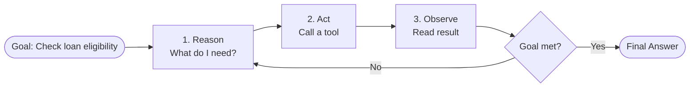

# Agentic AI: A Hands-On Learning Guide

> **For:** Software professionals learning to build agentic systems  
> **Goal:** Understand agents, build your first agent, ace the interview  
> **Time to first working agent:** ~30 minutes

---

## Part 1: Core Concepts (with Code)

### What is Agentic AI? (The One-Minute Version)

**Without agents:** You send a prompt to an LLM, it responds once. Done.
```python
from langchain_openai import ChatOpenAI

llm = ChatOpenAI(api_key="your-key")
response = llm.invoke("What's my loan eligibility?")
print(response.content)
# Output: "Based on typical criteria..." (guessing, no data)
```

**With agents:** The LLM becomes a decision-maker in a loop. It plans, uses tools, reads results, and decides the next move.
```
Loop:
1. Reason: "What should I do next?"
2. Act: Call a tool (database, API, calculator)
3. Observe: Read the result
4. Decide: Is the goal met? If not, loop back to step 1
```

**Real difference:** An agent *pursues a goal* by making decisions in a loop. A plain LLM just *answers*.

---

### The ReAct Loop (Reason + Act + Observe)

This is the heart of every agent framework.



**Code simulation (pseudo):**
```python
def agent_loop(goal, tools, llm):
    memory = []
    while True:
        # Step 1: Reason
        next_action = llm.reason(goal, memory, available_tools=tools)
        
        # Step 2: Act
        if next_action == "get_credit_score":
            result = tools["credit_score"](applicant_id)
        
        # Step 3: Observe
        memory.append({"action": next_action, "result": result})
        
        # Step 4: Decide
        if llm.is_goal_met(goal, memory):
            return llm.final_answer(goal, memory)
```

---

### Real Example: Loan Eligibility Agent

**Scenario:** A retail bank needs to decide if an applicant qualifies for a personal loan.

**Without agent (fails):**
```python
prompt = """
Given this applicant data:
Name: Raj Kumar
Income: ₹50,000/month
Existing EMI: ₹18,000/month

Are they eligible for a ₹5,00,000 loan?
"""
response = llm.invoke(prompt)
# Output: "Yes, likely eligible" (WRONG - no bureau check, no policy lookup)
```

**With agent (correct):**

| Step | Reason | Action | Observation | Next? |
|------|--------|--------|-------------|-------|
| 1 | "I need credit score first" | Call CIBIL bureau tool | Score = 710 | Continue |
| 2 | "Score is 710 (above 700 min). Check FOIR" | Call income-verification | FOIR = 36% (18k/50k) | Continue |
| 3 | "FOIR 36% < 50% limit. Check NPA flags" | Call core-banking lookup | No defaults found | Continue |
| 4 | "All checks pass. Make decision" | Approve | Eligible for ₹5,00,000 | **STOP** |

The agent decided *which* checks to run, *in what order*, and *stopped* when confident.

---

## Part 2: Building Your First Agent (LangChain + LangGraph)

### Setup

```bash
# Install dependencies
pip install langchain langchain-openai langchain-core python-dotenv
```

### Step 1: Define Your Tools

Tools are what the agent can "do" (call APIs, databases, calculations).

```python
# tools.py
from langchain_core.tools import tool

@tool
def get_credit_score(applicant_id: str) -> dict:
    """Fetch credit score from CIBIL bureau."""
    # In reality, this calls an actual API
    scores = {
        "APP001": 750,
        "APP002": 680,
        "APP003": 620
    }
    return {"applicant_id": applicant_id, "score": scores.get(applicant_id, 0)}

@tool
def check_income_ratio(applicant_id: str, monthly_income: float, proposed_emi: float) -> dict:
    """Check if EMI-to-income ratio is within policy limits."""
    foir = proposed_emi / monthly_income
    policy_limit = 0.50
    eligible = foir <= policy_limit
    return {
        "applicant_id": applicant_id,
        "foir": round(foir, 2),
        "policy_limit": policy_limit,
        "eligible": eligible
    }

@tool
def check_npa_history(applicant_id: str) -> dict:
    """Check for non-performing account (default) history."""
    npa_flags = {
        "APP001": False,
        "APP002": False,
        "APP003": True  # This one has defaults
    }
    return {"applicant_id": applicant_id, "has_npa": npa_flags.get(applicant_id, False)}

# Collect all tools
tools = [get_credit_score, check_income_ratio, check_npa_history]
```

### Step 2: Create the Agent with LangGraph

```python
# agent.py
import os
from dotenv import load_dotenv
from langchain_openai import ChatOpenAI
from langchain_core.prompts import ChatPromptTemplate, MessagesPlaceholder
from langchain.agents import AgentExecutor, create_tool_calling_agent
from tools import tools

load_dotenv()

def create_loan_agent():
    """Create a loan eligibility agent."""
    
    # Initialize LLM
    llm = ChatOpenAI(
        model="gpt-4",
        api_key=os.getenv("OPENAI_API_KEY"),
        temperature=0
    )
    
    # Define the agent's system prompt
    system_prompt = """You are a loan eligibility officer for a retail bank.
    
Your job: Decide if an applicant qualifies for a personal loan.

Policy rules:
- Minimum credit score: 700
- Maximum FOIR (EMI / Income): 50%
- No active NPA (defaults) allowed

Steps:
1. Get the applicant's credit score
2. Check their EMI-to-income ratio
3. Check for NPA history
4. Make a decision based on all three checks

Be thorough. Check all three before deciding. Explain your reasoning."""

    # Create the prompt template
    prompt = ChatPromptTemplate.from_messages([
        ("system", system_prompt),
        MessagesPlaceholder(variable_name="chat_history"),
        ("human", "{input}"),
        MessagesPlaceholder(variable_name="agent_scratchpad")
    ])
    
    # Create the agent
    agent = create_tool_calling_agent(llm, tools, prompt)
    
    # Wrap in executor
    executor = AgentExecutor(agent=agent, tools=tools, verbose=True)
    
    return executor

# Run the agent
if __name__ == "__main__":
    agent = create_loan_agent()
    
    # Test case
    result = agent.invoke({
        "input": """
        Check loan eligibility for applicant APP001:
        - Requested loan: ₹5,00,000
        - Monthly income: ₹50,000
        - Proposed EMI: ₹18,000/month
        
        Make a clear decision: Approve or Reject.
        """,
        "chat_history": []
    })
    
    print("\n" + "="*50)
    print("AGENT DECISION:")
    print("="*50)
    print(result["output"])
```

### Step 3: Run It

```bash
python agent.py
```

**Expected output:**
```
Agent thinking: "First, I need the credit score..."
Tool called: get_credit_score(APP001)
Result: score = 750

Agent thinking: "Score is good. Now check FOIR..."
Tool called: check_income_ratio(APP001, 50000, 18000)
Result: FOIR = 0.36 (within 50% limit)

Agent thinking: "FOIR is OK. Check for defaults..."
Tool called: check_npa_history(APP001)
Result: No NPA

Agent decision:
APPROVED: Applicant APP001 qualifies for ₹5,00,000 loan.
- Credit score: 750 ✓
- FOIR: 36% ✓
- No defaults ✓
```

---

## Part 3: Framework Choices (with Decision Tree)

### LangGraph vs CrewAI vs AutoGen

They all do agents, but differently.

```
┌─────────────────────────────────────────┐
│ Which framework should I use?            │
└─────────────────────────────────────────┘
         |
         ├─→ Does my workflow need cycles, retries, or human approval?
         |   YES → **LangGraph** ✓ (loan approval, healthcare triage)
         |   NO  → Go to next question
         |
         ├─→ Does my work split naturally into team roles?
         |   YES → **CrewAI** ✓ (research + writing + review)
         |   NO  → Go to next question
         |
         └─→ Do I need agents to chat and iterate?
             YES → **AutoGen / AG2** ✓ (code debugging, research)
             NO  → Plain LangChain might be enough
```

### Quick Comparison

| Feature | LangGraph | CrewAI | AutoGen / AG2 |
|---------|-----------|--------|---------------|
| **Best for** | Cycles, branches, HITL, regulated work | Fast prototypes with team roles | Research, code execution, back-and-forth |
| **Code complexity** | Explicit state, graph structure | Minimal, very Pythonic | Agent conversation model |
| **Production ready** | Yes (1.0 stable) | Yes (1.x) | Yes (AG2, community-maintained) |
| **Learning curve** | Steeper (but worth it) | Gentler | Moderate |
| **Example** | Loan approval flow | Research crew (analyst + writer + reviewer) | Code bug hunt (Agent A suggests fix, Agent B reviews) |

### When to Use LangGraph (Most Common for Interviews)

You'll pick **LangGraph** when you need:
- ✅ Explicit control over workflow
- ✅ Loops (retry logic, re-planning)
- ✅ Branching (if X, do Y; else do Z)
- ✅ Human approval gates (before irreversible actions)
- ✅ State that persists across steps

**Interview question:** "Why LangGraph for this loan approval system?"

**Answer:** "Because the workflow has branching (approve/reject) and a human approval gate before disbursing money. LangGraph gives us explicit control over state and lets us pause for human review — that's critical in regulated BFSI work."

---

## Part 4: ReAct vs Plan-and-Execute

### Pattern A: ReAct (Step-by-Step, No Plan)

The agent reasons about *only the next step*, acts, observes, *then* decides the following step from what it just saw.

```
Decide next step live ← based on what just happened
   ↓
Take action
   ↓
Observe result
   ↓
Decide next step live ← based on new info
   ↓
...loop until goal met
```

**When to use:**
- Work where the next step depends on the last result (branching)
- Complex, unpredictable workflows

**Code example (our loan agent above):** It checks credit score, *then based on that result*, decides whether to check FOIR next.

### Pattern B: Plan-and-Execute (Plan First, Then Act)

The agent first breaks the goal into a full ordered plan, *then* executes each step.

```
Make full plan upfront
   ↓
Execute step 1
   ↓
Surprise? Re-plan | Continue to step 2
   ↓
...repeat until done
```

**When to use:**
- Well-understood, mostly linear workflows (e.g., monthly report generation)
- Steps don't branch based on results

**Code example:**
```python
# Plan-first approach
def plan_and_execute_agent(goal, tools, llm):
    # Step 1: Make the full plan
    plan = llm.make_plan(goal, tools)
    # Plan: ["extract_data", "validate", "summarize", "publish"]
    
    # Step 2: Execute each step in order
    for step in plan:
        result = execute_step(step, tools)
        if unexpected(result):
            # Re-plan based on surprise
            plan = llm.replan(goal, plan, result)
    
    return final_result
```

### Trade-Off Comparison

| | ReAct | Plan-and-Execute |
|---|---|---|
| **LLM calls** | More (reasons at every step) | Fewer (one plan, then execute) |
| **Handles surprises** | Naturally (every step reacts) | Needs explicit re-plan step |
| **Best for** | Branchy, reactive workflows | Linear, predictable workflows |
| **Cost** | Higher (more reasoning) | Lower (fewer model calls) |
| **Code complexity** | Simpler (loop handles it) | More (plan + execute + re-plan) |

**Interview Q: "Our system has 100k loan applications/day. ReAct or Plan-and-Execute?"**

**Answer:** "Plan-and-Execute. Each application follows the same three checks (credit, FOIR, NPA), so we can plan once and execute. ReAct would waste money reasoning at every step when the path is predictable. We'd use ReAct if applications had complex logic like 'if score < 650 AND no co-signer, escalate; else continue.'"

---

## Part 5: Model Platforms (OpenAI vs Azure vs Bedrock)

These are **not frameworks**. They're where the LLM lives.

```
Your Agent (LangGraph/CrewAI)
        ↓
    Calls LLM API
        ↓
    Model Platform (picks one):
    - OpenAI API
    - Azure AI Foundry (Azure OpenAI)
    - AWS Bedrock
```

### Quick Comparison

| | OpenAI | Azure AI Foundry | AWS Bedrock |
|---|---|---|---|
| **Models** | GPT-4, GPT-4o | GPT-4, GPT-4o (+ some others) | Claude, Nova, Llama, Mistral, GPT, Cohere... |
| **Data residency** | OpenAI's servers | Your Azure region | Your AWS VPC/region |
| **Best for** | Prototypes, startups | Microsoft-stack enterprises | AWS-stack enterprises, multi-model routing |
| **India option** | ❌ | ✓ India regions | ✓ Mumbai region (Sept 2024) |
| **Compliance** | You handle it | Azure-native (Entra ID, etc.) | AWS-native (IAM, CloudTrail) |

### Real Example: Indian Bank Choice

**Scenario:** A Chennai-based bank needs a KYC review agent.

**Compliance requirements:**
- Data must stay in India
- Prompts must NOT train the model
- Audit log required for regulators

**Best choice:** **AWS Bedrock (Mumbai region)**
- ✅ Data stays in your VPC (not leaving India)
- ✅ Bedrock doesn't train on prompts
- ✅ All calls logged in CloudTrail (audit trail for RBI)
- ✅ Can swap models (start with Claude, scale cheap work to Nova) without rewriting

**If** the bank were Azure-native and had legal approval for Azure → Azure AI Foundry.

**If** it were a startup with no compliance burden → OpenAI direct (simplest).

---

## Part 6: Interview Questions & Answers

### Q1: "Explain agentic AI in 2 minutes."

**Answer:**
"Regular LLMs respond once to a prompt. Agentic AI is different—the LLM becomes a decision-maker in a loop. It reasons about what to do, uses tools (APIs, databases), reads the results, and decides the next step. It repeats this loop until the goal is met.

Think of it like a human employee: they don't need step-by-step instructions. You give them a goal ('approve loans'), they decide what data they need, fetch it, analyze it, and report back. That's what an agent does.

The loop is: Reason → Act (use a tool) → Observe (read result) → Decide (goal met? if not, loop). We call this ReAct."

### Q2: "Design a customer support agent for us. What framework? What tools?"

**Answer:**
"I'd use **LangGraph** because support often needs branching and human handoff.

**Tools:**
- `search_knowledge_base` — find relevant docs
- `check_order_status` — look up their order
- `create_ticket` — escalate to human if I can't solve it

**Workflow (as a graph):**
```
Start → Read customer message
        → Search knowledge base
        → Can I help? 
          - YES → Provide answer → End
          - NO → Create support ticket → Escalate to human → End
```

**Why LangGraph:** The branching (can I help or not?) and human handoff (escalate to an agent) need explicit control. LangGraph gives us that.

**Key design:** Human approval is the last gate—the agent never closes a ticket; it only creates one. A human must review and close."

### Q3: "You have 1M transactions/day to categorize. ReAct or Plan-and-Execute?"

**Answer:**
"**Plan-and-Execute.**

Each transaction follows the same logic: extract fields → match against rules → assign category. It's linear, predictable. ReAct would waste money reasoning at every step.

With Plan-and-Execute:
- Agent makes one plan: ['extract', 'rules_check', 'categorize']
- Executes it 1M times
- If a transaction surprises the model (weird format), it re-plans for that one

Cost: ~1 plan call per 1000 transactions (occasional re-plans)
Benefit: Saves on unnecessary reasoning."

### Q4: "Our LLM is slow. How do you optimize?"

**Answer:**
"Several levers:

1. **Framework level:** Use Plan-and-Execute instead of ReAct (fewer LLM calls).
2. **Model level:** Route easy tasks to cheaper models. E.g., Bedrock lets you route 'is this fraud?' (simple) to a small model, 'assess credit file' (complex) to Claude Opus.
3. **Prompt level:** Give clearer instructions so the model doesn't loop/re-reason.
4. **Caching:** If the first step is always the same (e.g., 'here's the policy'), cache it so you don't re-process.

For our example: Loan checks rarely change, so I'd cache the policy rules in the system prompt. First call: 2s (includes cache), subsequent calls: 0.3s (hit the cache)."

### Q5: "What breaks? How do you handle it?"

**Answer:**
"**Common failures:**

1. **Tool fails** (API is down) → Retry 3 times with exponential backoff. If still down, escalate to human.
2. **LLM refuses** (thinks the request is harmful) → Log it, escalate to human.
3. **Infinite loop** (agent keeps reasoning without progress) → Set a max-step limit (e.g., 10 steps). If hit, escalate.
4. **Hallucination** (agent makes up a tool call) → Validate every tool call against the schema before executing.

**Code sketch:**
```python
max_steps = 10
steps = 0
while not goal_met and steps < max_steps:
    next_action = agent.reason(...)
    
    # Validate
    if not is_valid_tool(next_action.tool):
        escalate_to_human()
        break
    
    # Execute with retry
    try:
        result = execute_with_retry(next_action.tool, max_retries=3)
    except ToolFailure:
        escalate_to_human()
        break
    
    steps += 1

if steps == max_steps:
    escalate_to_human('Agent hit max steps')
```

This is production-grade thinking: always have a human escape hatch."

### Q6: "LangGraph, CrewAI, or AutoGen? You're prototyping a research assistant."

**Answer:**
"**CrewAI.**

Why: The work splits naturally into roles:
- *Researcher Agent* → searches the web, reads papers
- *Writer Agent* → drafts the report
- *Reviewer Agent* → checks for accuracy

CrewAI makes this super easy—you define roles, tools, and tasks. It's the fastest path to a working prototype.

If I needed production-grade control over state, retries, and human approval → LangGraph.
If the work involved back-and-forth agent conversation → AutoGen."

### Q7: "How do you handle cost in production?"

**Answer:**
"Three strategies:

1. **Model routing:** Don't use GPT-4 for everything.
   ```python
   if task == 'simple_classification':
       use_model = 'gpt-3.5-turbo'  # Cheap
   elif task == 'complex_reasoning':
       use_model = 'gpt-4'  # Expensive but better
   ```

2. **Caching:** Static data (policies, rules) get cached.
   ```
   System: "Here's the bank's loan policy (this doesn't change): ..."
   (Cached on first call, reused on subsequent calls)
   ```

3. **Async batching:** If tasks don't depend on each other, batch them.
   ```python
   # Instead of checking 1000 loans one-by-one
   # Check them in parallel batches
   ```

For Bedrock (AWS), you can even use provisioned throughput—pay a flat monthly fee for guaranteed capacity, very cost-effective at scale."

### Q8: "Walk me through your loan eligibility agent code."

**Answer:** (Point to your working code)

"Sure. Here's how it works:

**Step 1:** Define tools (get_credit_score, check_foir, check_npa).

**Step 2:** Create agent with LangGraph. The system prompt tells it the policy rules.

**Step 3:** Agent receives a loan application. It runs the loop:
1. Reason: 'I need to check credit score first'
2. Act: Calls get_credit_score(APP001) → returns 750
3. Observe: Score 750 > 700 minimum ✓
4. Decide: Goal not met, continue
5. Loop back...

**Step 4:** After all three checks pass, it outputs the decision.

**Key design:** The agent can't approve/reject by itself. It makes a recommendation, and a human (banker) must approve before money disburses. That's the human-in-the-loop gate."

---

## Part 7: Decision Trees (Use These in Interviews)

### "Which framework should I use?"

```
START: What's your problem?
  ↓
  ├─ "We need a loan approval workflow with branching and human sign-off"
  │   → LangGraph ✓
  │
  ├─ "We want to prototype a research assistant fast"
  │   → CrewAI ✓
  │
  ├─ "We need agents to debug code by talking to each other"
  │   → AG2 / AutoGen ✓
  │
  └─ "It's just a simple Q&A chatbot"
      → Plain LangChain (not an agent)
```

### "Which model platform?"

```
START: Where's your org?
  ↓
  ├─ AWS-native & need multi-model
  │   → Bedrock ✓ (especially if India-based)
  │
  ├─ Microsoft-stack, already use Azure
  │   → Azure AI Foundry ✓
  │
  ├─ Prototyping, startup, no compliance
  │   → OpenAI direct ✓ (simplest)
  │
  └─ Enterprise BFSI in India
      → AWS Bedrock (Mumbai) ✓ (data stays in India, CloudTrail audit)
```

### "ReAct or Plan-and-Execute?"

```
START: Is your workflow predictable?
  ↓
  ├─ "Yes, mostly the same steps every time"
  │   → Plan-and-Execute ✓ (cheaper, fewer LLM calls)
  │
  └─ "No, the next step depends on the result"
      → ReAct ✓ (handles branching naturally)
```

---

## Part 8: Common Interview Mistakes to Avoid

❌ **"Agents can do anything. They're magic."**
✅ **"Agents are good at multi-step work with decisions. Use them when a plain LLM call isn't enough."**

❌ **"Let's use AutoGen for everything."**
✅ **"AutoGen is great for research and code. For regulated work (loans, health), use LangGraph."**

❌ **"LangGraph is too complex."**
✅ **"LangGraph is explicit, which is a feature. It makes control clear—important in production."**

❌ **"More LLM calls = better results."**
✅ **"More LLM calls = slower + more expensive. Use Plan-and-Execute for linear work."**

❌ **"I'll use OpenAI API. It's the most popular."**
✅ **"That depends on your compliance bar, cloud lock-in, and data residency. I'd pick based on those constraints."**

---

## Part 9: Quick Reference

### Setup (1st time)
```bash
pip install langchain langchain-openai langchain-core python-dotenv
# Create .env file with OPENAI_API_KEY=...
```

### Minimal Agent (5 steps)
```python
from langchain_openai import ChatOpenAI
from langchain.agents import create_tool_calling_agent, AgentExecutor
from langchain_core.tools import tool

# 1. Define a tool
@tool
def get_data(id: str):
    return {"id": id, "value": 100}

# 2. Create LLM
llm = ChatOpenAI(model="gpt-4")

# 3. Create agent
agent = create_tool_calling_agent(llm, [get_data], prompt_template)

# 4. Wrap in executor
executor = AgentExecutor(agent=agent, tools=[get_data], verbose=True)

# 5. Run
result = executor.invoke({"input": "Get data for ID 123"})
print(result["output"])
```

### The ReAct Loop (in pseudocode)
```
while goal_not_met:
    reason = llm.think("What's next?")  # Decide
    action = llm.choose_tool(reason)    # Which tool?
    result = tool.execute(action)       # Use it
    memory.add(action, result)          # Remember
    if llm.goal_met(memory):            # Check goal
        break
return llm.final_answer(memory)
```

---

## Part 10: Next Steps

1. **Today:** Run the loan eligibility agent (Part 2).
2. **This week:** Build your own agent (pick a problem from your work).
3. **Next week:** Deploy it (error handling, retries, logging).
4. **Interview ready:** Explain your agent to a peer. Can you justify framework + tool choices?

---

## References & Further Reading

- **LangChain docs:** https://python.langchain.com/docs/agents/
- **LangGraph docs:** https://langchain-ai.github.io/langgraph/
- **CrewAI docs:** https://docs.crewai.com/
- **OpenAI Function Calling:** https://platform.openai.com/docs/guides/function-calling

---

**You've got this.** Agents feel like magic until you've built one. After that, they're just loops + tools + memory. Start small, build real.
