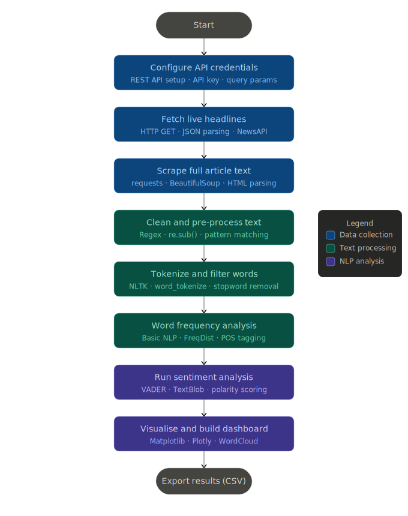

# NLP Complete Beginner Guide
### Natural Language Processing from Zero to Hands-On

---



---

## What is NLP?

NLP (Natural Language Processing) is teaching a computer to read, understand, and work with human language. Computers only understand numbers — NLP converts raw text into numbers computers can process.

**Java analogy:** Raw text -> NLP pipeline -> numbers/structure (same as String -> parsing -> typed objects)

---

## The Full NLP Pipeline

Every NLP project follows this exact pipeline. Tools change, structure stays the same.

```
Raw Text (messy, noisy)
        |
1.  Text Cleaning       -> remove URLs, HTML, punctuation, numbers
        |
2.  Tokenization        -> split into individual words
        |
3.  Normalisation       -> lowercase, stemming or lemmatization
        |
4.  Stopword Removal    -> remove "the", "is", "a", "at" ...
        |
5.  Feature Extraction  -> word frequency, TF-IDF, n-grams
        |
6.  Analysis            -> sentiment, topics, named entities
        |
7.  Visualisation       -> charts, word clouds, dashboards
```

---

## Concept 1 - Text Cleaning with Regex

Raw text is always messy: URLs, HTML tags, punctuation, numbers, symbols.
Regex is a pattern-matching language that finds and removes noise. Think of it as super-powered Find and Replace.

### Common Patterns

| Pattern          | Meaning                  | Before                          | After               |
|------------------|--------------------------|---------------------------------|---------------------|
| `https?://\S+`   | Any URL                  | "Visit https://bbc.com today"   | "Visit  today"      |
| `<[^>]+>`        | Any HTML tag             | "<b>BREAKING</b> news"          | "BREAKING news"     |
| `[^a-zA-Z\s]`    | Not a letter or space    | "Stock up 3.4%!"                | "Stock up "         |
| `\s+`            | Multiple spaces          | "too  many   spaces"            | "too many spaces"   |
| `\b[A-Z]{2,5}\b` | ALL CAPS words (tickers) | "AAPL hits record"              | extracts "AAPL"     |

### Hands-On Code - Type This

```python
import re

raw = "Apple Inc. (AAPL) shares up 3.4%! Read more: https://t.co/abc123 <br/>"

text = re.sub(r'https?://\S+', '', raw)           # remove URLs
text = re.sub(r'<[^>]+>', '', text)                # remove HTML tags
text = re.sub(r'[^a-zA-Z\s]', '', text)           # keep only letters
text = re.sub(r'\s+', ' ', text).strip().lower()  # clean spaces + lowercase
print(text)
# apple inc aapl shares up
```

**Why Required?** Without cleaning, "Apple!", "Apple," and "Apple" are 3 different words.
Cleaning makes them all the single token "apple".

---

## Concept 2 - Tokenization

Tokenization splits a string into individual words (tokens). Always the first real NLP step after cleaning.

```
"good morning world"  ->  ["good", "morning", "world"]
```

| Type                  | Function           | Example                                        |
|-----------------------|--------------------|------------------------------------------------|
| Word tokenization     | `word_tokenize()`  | "Hello world" -> ["Hello", "world"]            |
| Sentence tokenization | `sent_tokenize()`  | Long article -> list of sentences              |

### Hands-On Code - Type This

```python
from nltk.tokenize import word_tokenize, sent_tokenize

headline = "Markets fell sharply. Investors are worried about inflation."

words = word_tokenize(headline)
print(words)
# ['Markets', 'fell', 'sharply', '.', 'Investors', 'are', 'worried', 'about', 'inflation', '.']

sentences = sent_tokenize(headline)
print(sentences)
# ['Markets fell sharply.', 'Investors are worried about inflation.']
```

Note: punctuation becomes its own token. Filter with `.isalpha()` to keep only real words.

---

## Concept 3 - Stopword Removal

Stopwords are common words that appear everywhere but carry no meaning: "the", "is", "at", "a", "and" ...

```
Before: ["markets", "fell", "sharply", "and", "the", "investors", "are", "worried"]
After:  ["markets", "fell", "sharply", "investors", "worried"]
```

### Hands-On Code - Type This

```python
from nltk.corpus import stopwords
from nltk.tokenize import word_tokenize

STOP_WORDS = set(stopwords.words('english'))
STOP_WORDS.update(['said', 'says', 'new', 'us', 'also', 'one', 'two', 'year'])

text = "The markets fell sharply and the investors are deeply worried"
tokens = word_tokenize(text.lower())

filtered = [t for t in tokens if t.isalpha() and t not in STOP_WORDS]
print(filtered)
# ['markets', 'fell', 'sharply', 'investors', 'deeply', 'worried']
```

**Why Required?** Without removing stopwords, "the", "a", "is" appear as most common words — useless for analysis.

---

## Concept 4 - Stemming and Lemmatization

Different forms of the same word should count as one:
```
"running", "runs", "ran"  -> all mean run
"economy", "economic"     -> same root concept
```

| Approach       | How                          | "running"  | "studies"      |
|----------------|------------------------------|------------|----------------|
| Stemming       | Chops endings (crude, fast)  | run        | studi (WRONG)  |
| Lemmatization  | Uses dictionary (accurate)   | run        | study (RIGHT)  |

**Rule: Always use Lemmatization for NLP. Use Stemming only when speed > accuracy.**

### Hands-On Code - Type This

```python
from nltk.stem import PorterStemmer
from nltk.stem import WordNetLemmatizer
import nltk
nltk.download('wordnet', quiet=True)

stemmer    = PorterStemmer()
lemmatizer = WordNetLemmatizer()

words = ["running", "studies", "better", "wolves", "caring", "happily"]

print(f"{'Word':<15} | {'Stem':<15} | Lemma")
print("-" * 45)
for word in words:
    stem  = stemmer.stem(word)
    lemma = lemmatizer.lemmatize(word, pos='v')   # pos='v' = treat as verb
    print(f"{word:<15} | {stem:<15} | {lemma}")

# running         | run            | run
# studies         | studi          | study   <- stemming wrong, lemma right
# wolves          | wolv           | wolf
```

---

## Concept 5 - Frequency Analysis

Count how often each word appears. Most frequent words = dominant topics in the data.

### Hands-On Code - Type This

```python
from nltk.probability import FreqDist
import matplotlib.pyplot as plt

tokens = ["economy", "market", "economy", "crash", "economy",
          "inflation", "market", "economy", "crash", "interest"]

freq = FreqDist(tokens)

print("Top 5 words:")
for word, count in freq.most_common(5):
    print(f"  {word:<15} {count}")

# Bar chart
top           = freq.most_common(10)
words, counts = zip(*top)

plt.figure(figsize=(10, 4))
plt.bar(words, counts, color='steelblue')
plt.xticks(rotation=45, ha='right')
plt.title("Word Frequency")
plt.ylabel("Count")
plt.tight_layout()
plt.show()
```

---

## Concept 6 - POS Tagging (Part of Speech)

Labels each word with its grammatical role so you know what type of word it is.

| Tag | Meaning     | Example words            |
|-----|-------------|--------------------------|
| NN  | Noun        | market, economy, bank    |
| VB  | Verb        | fell, rise, crash        |
| JJ  | Adjective   | sharp, positive, strong  |
| RB  | Adverb      | sharply, quickly         |
| NNP | Proper noun | Apple, Tesla, Biden      |

### Hands-On Code - Type This

```python
import nltk

tokens = ["Markets", "fell", "sharply", "as", "Apple", "reported", "strong", "earnings"]
tagged = nltk.pos_tag(tokens)

for word, tag in tagged:
    print(f"{word:<15} -> {tag}")

# Extract proper nouns (companies, people, places = named entities)
proper_nouns = [word for word, tag in tagged if tag == 'NNP']
print("\nProper nouns:", proper_nouns)
# ['Markets', 'Apple']
```

---

## Concept 7 - N-grams (Phrases, Not Just Words)

An n-gram is a sequence of N consecutive words. Captures phrases, not just single words.

```
Text: "stock market crash"

Unigrams (1 word):  ["stock", "market", "crash"]
Bigrams  (2 words): [("stock", "market"), ("market", "crash")]
Trigrams (3 words): [("stock", "market", "crash")]
```

**Why Important:**
- "not good" as bigram = negative. As unigrams "not" + "good" loses the meaning.
- "interest rate" means something specific. Separate words mean less.

### Hands-On Code - Type This

```python
from nltk.util import ngrams
from nltk.tokenize import word_tokenize
from nltk.probability import FreqDist

text = "the stock market crash caused massive interest rate hikes"
tokens = word_tokenize(text)

# Bigrams
bigrams = list(ngrams(tokens, 2))
print("Bigrams:")
for bg in bigrams[:5]:
    print(" ", bg)

# Trigrams
trigrams = list(ngrams(tokens, 3))
print("\nTrigrams:")
for tg in trigrams[:3]:
    print(" ", tg)

# Most common bigrams across many sentences
sentences = [
    "interest rate hike expected",
    "stock market falls sharply",
    "interest rate decision today",
    "stock market rebounds strongly"
]
all_bigrams = []
for sent in sentences:
    toks = word_tokenize(sent)
    all_bigrams.extend([" ".join(bg) for bg in ngrams(toks, 2)])

freq = FreqDist(all_bigrams)
print("\nTop bigrams:", freq.most_common(5))
# [('interest rate', 2), ('stock market', 2), ...]
```

---

## Concept 8 - TF-IDF (Term Frequency - Inverse Document Frequency)

**Problem with plain frequency:** "market" may appear 100 times but if it is in EVERY article it is not distinctive.

TF-IDF scores words by importance to ONE document compared to ALL documents.

```
TF      = how often word appears in THIS document
IDF     = how rare the word is across ALL documents (log-scaled)
TF-IDF  = TF x IDF
```

| Word             | This doc | All docs | TF-IDF | Verdict             |
|------------------|----------|----------|--------|---------------------|
| "market"         | 10x      | every    | low    | common, not useful  |
| "cryptocurrency" | 8x       | 2 docs   | high   | distinctive!        |
| "the"            | 20x      | every    | ~0     | useless             |

### Hands-On Code - Type This

```python
from sklearn.feature_extraction.text import TfidfVectorizer
import pandas as pd

documents = [
    "stock market crash hits investors hard",
    "cryptocurrency bitcoin reaches new record high",
    "stock market rebounds after fed rate decision",
    "apple stock hits record high earnings beat"
]

vectorizer   = TfidfVectorizer(stop_words='english')
tfidf_matrix = vectorizer.fit_transform(documents)

feature_names = vectorizer.get_feature_names_out()
df_tfidf = pd.DataFrame(
    tfidf_matrix.toarray(),
    columns=feature_names,
    index=[f"Doc {i+1}" for i in range(len(documents))]
)
print(df_tfidf.round(2))

# Top distinctive words in Doc 1
print("\nTop words in Doc 1:")
print(df_tfidf.loc["Doc 1"].sort_values(ascending=False).head(5))
```

---

## Concept 9 - Sentiment Analysis with VADER

VADER uses a word dictionary with pre-assigned scores + smart grammar rules.

**Smart rules:**
- "GREAT" scores higher than "great"     (ALL CAPS = emphasis)
- "great!!!" scores higher than "great"  (punctuation = emphasis)
- "not bad" -> positive                  (understands negation)

| Score    | Meaning                   | Range        |
|----------|---------------------------|--------------|
| compound | Overall summary score     | -1.0 to +1.0 |
| pos      | Proportion positive words | 0.0 to 1.0   |
| neg      | Proportion negative words | 0.0 to 1.0   |
| neu      | Proportion neutral words  | 0.0 to 1.0   |

Labels: `compound >= +0.05` = Positive, `<= -0.05` = Negative, else = Neutral

### Hands-On Code - Type This

```python
from vaderSentiment.vaderSentiment import SentimentIntensityAnalyzer

vader = SentimentIntensityAnalyzer()

headlines = [
    "Scientists discover breakthrough cancer treatment",
    "Markets crash as inflation fears grow",
    "Federal Reserve meets tomorrow to discuss rates",
    "NOT bad results from Apple this quarter",
    "AMAZING! Stock market hits ALL TIME HIGH!!!",
]

print(f"{'Headline':<50} | Compound | Label")
print("-" * 75)
for h in headlines:
    scores   = vader.polarity_scores(h)
    compound = scores['compound']
    label    = "Positive" if compound >= 0.05 else "Negative" if compound <= -0.05 else "Neutral"
    print(f"{h[:50]:<50} | {compound:+.3f}   | {label}")
```

---

## Concept 10 - TextBlob (Polarity + Subjectivity)

**Two scores:**
- polarity     -> -1.0 (negative) to +1.0 (positive)
- subjectivity -> 0.0 (objective/factual) to 1.0 (subjective/opinion)

**Why subjectivity matters:**
```
"Unemployment rose to 8%"                    polarity: -0.1, subjectivity: 0.05  -> FACT
"This government is destroying our economy"  polarity: -0.8, subjectivity: 0.85  -> OPINION
```
Both negative — subjectivity tells you one is a fact, one is an opinion.

### Hands-On Code - Type This

```python
from textblob import TextBlob

texts = [
    "GDP grew 4.2% last quarter",
    "This is absolutely the worst economic policy ever",
    "Scientists confirm vaccine is highly effective",
    "What a brilliant and inspiring speech!",
]

print(f"{'Text':<50} | Polarity | Subjectivity")
print("-" * 75)
for t in texts:
    blob = TextBlob(t)
    pol  = blob.sentiment.polarity
    subj = blob.sentiment.subjectivity
    kind = "Fact" if subj < 0.3 else "Opinion"
    print(f"{t[:50]:<50} | {pol:+.3f}   | {subj:.3f}  ({kind})")
```

---

## Concept 11 - Consensus Label (VADER + TextBlob Together)

Neither is always right. Using both and checking agreement improves reliability.

```python
def consensus_label(vader_label, tb_label):
    if vader_label == tb_label:
        return vader_label       # both agree - trust it
    if vader_label == "Neutral":
        return tb_label          # VADER unsure - use TextBlob
    if tb_label == "Neutral":
        return vader_label       # TextBlob unsure - use VADER
    return "Neutral"             # conflict - safe fallback
```

| Headline                     | VADER    | TextBlob | Consensus | Why                            |
|------------------------------|----------|----------|-----------|--------------------------------|
| "Not doing terribly today"   | Positive | Negative | Positive  | VADER handles negation better  |
| "A magnificent achievement"  | Neutral  | Positive | Positive  | TextBlob better with adjectives|
| "Markets fell"               | Negative | Negative | Negative  | Both agree                     |

---

## Concept 12 - REST API and JSON

A REST API is a way for Python to request data from a server on the internet.

```
You (Python)  ->  HTTP GET request  ->  NewsAPI Server
You (Python)  <-  JSON response     <-  NewsAPI Server
```

Like ordering food online: you place an order (request), you receive your delivery (response).

### Hands-On Code - Type This

```python
import requests

API_KEY  = "your_key_here"   # free at newsapi.org/register
BASE_URL = "https://newsapi.org/v2"

def fetch_headlines(category="technology", page_size=5):
    url    = f"{BASE_URL}/top-headlines"
    params = {"apiKey": API_KEY, "category": category, "country": "us", "pageSize": page_size}
    response = requests.get(url, params=params, timeout=10)

    if response.status_code != 200:
        print(f"Error: {response.status_code}")
        return []

    return response.json().get("articles", [])

articles = fetch_headlines()
for art in articles:
    print(art["title"])
```

---

## Concept 13 - Web Scraping (BeautifulSoup)

NewsAPI gives only ~200 chars per article. Web scraping gets the full article text.

- `requests`      -> downloads raw HTML
- `BeautifulSoup` -> parses HTML, extracts specific elements

### Hands-On Code - Type This

```python
import requests
from bs4 import BeautifulSoup
import time

HEADERS = {"User-Agent": "Mozilla/5.0 (Windows NT 10.0; Win64; x64) AppleWebKit/537.36"}

def scrape_article(url):
    try:
        response   = requests.get(url, headers=HEADERS, timeout=8)
        response.raise_for_status()
        soup       = BeautifulSoup(response.text, 'html.parser')

        article    = soup.find('article')
        paragraphs = article.find_all('p') if article else soup.find_all('p')

        return ' '.join(p.get_text() for p in paragraphs).strip()
    except Exception as e:
        print(f"Failed: {e}")
        return ""

text = scrape_article("https://example-news-site.com/article")
time.sleep(1)   # always wait between requests
print(text[:300])
```

**Responsible scraping rules:**
1. Add User-Agent header — identify yourself politely
2. `time.sleep(1)` between requests — do not flood the server
3. Handle errors with `try/except` — some sites block scraping
4. Respect `robots.txt`

---

## Concept 14 - Word Cloud

### Hands-On Code - Type This

```python
from wordcloud import WordCloud
import matplotlib.pyplot as plt

tokens = ["economy", "market", "economy", "crash", "economy",
          "inflation", "market", "economy", "crash", "interest"]

wc = WordCloud(
    width=800, height=400,
    background_color='white',
    colormap='RdYlGn',
    max_words=100,
    collocations=False
).generate(" ".join(tokens))

plt.figure(figsize=(12, 5))
plt.imshow(wc, interpolation='bilinear')
plt.axis('off')
plt.title("Word Cloud", fontsize=14, fontweight='bold')
plt.show()
```

---

## Full Pipeline Summary

| Step | Concept              | Tool                | What It Does                        |
|------|----------------------|---------------------|-------------------------------------|
| 1    | Text Cleaning        | `re` (regex)        | Remove URLs, HTML, symbols          |
| 2    | Tokenization         | `nltk`              | Split text into words               |
| 3    | Normalisation        | `nltk.stem`         | Stem or lemmatize words             |
| 4    | Stopword Removal     | `nltk.corpus`       | Remove meaningless words            |
| 5    | Frequency Analysis   | `nltk.FreqDist`     | Count word occurrences              |
| 6    | N-grams              | `nltk.util.ngrams`  | Extract phrases (2-3 words)         |
| 7    | POS Tagging          | `nltk.pos_tag`      | Label nouns, verbs, adjectives      |
| 8    | TF-IDF               | `sklearn`           | Score word importance per document  |
| 9    | Sentiment (VADER)    | `vaderSentiment`    | Score short/informal text           |
| 10   | Sentiment (TextBlob) | `textblob`          | Score + subjectivity                |
| 11   | REST API             | `requests`          | Fetch live news data                |
| 12   | Web Scraping         | `BeautifulSoup`     | Extract full article text           |
| 13   | Word Cloud           | `wordcloud`         | Visualise word frequency            |

---

## NLP Tools Quick Reference

```python
# 1 - Cleaning
import re
re.sub(r'https?://\S+', '', text)      # remove URLs
re.sub(r'<[^>]+>', '', text)           # remove HTML
re.sub(r'[^a-zA-Z\s]', '', text)      # keep only letters

# 2 - Tokenization
from nltk.tokenize import word_tokenize
tokens = word_tokenize(text)

# 3 - Stopwords
from nltk.corpus import stopwords
STOP = set(stopwords.words('english'))
tokens = [t for t in tokens if t not in STOP]

# 4 - Stemming / Lemmatization
from nltk.stem import PorterStemmer, WordNetLemmatizer
stem  = PorterStemmer().stem("running")          # -> run
lemma = WordNetLemmatizer().lemmatize("studies")  # -> study

# 5 - Frequency
from nltk.probability import FreqDist
freq = FreqDist(tokens)
freq.most_common(10)

# 6 - N-grams
from nltk.util import ngrams
bigrams = list(ngrams(tokens, 2))

# 7 - POS Tagging
import nltk
tagged = nltk.pos_tag(tokens)

# 8 - TF-IDF
from sklearn.feature_extraction.text import TfidfVectorizer
tfidf  = TfidfVectorizer(stop_words='english')
matrix = tfidf.fit_transform(documents)

# 9 - VADER
from vaderSentiment.vaderSentiment import SentimentIntensityAnalyzer
vader  = SentimentIntensityAnalyzer()
scores = vader.polarity_scores(text)   # compound, pos, neg, neu

# 10 - TextBlob
from textblob import TextBlob
blob = TextBlob(text)
blob.sentiment.polarity       # -1 to +1
blob.sentiment.subjectivity   # 0 to 1
```

---

## Quick Decision Guide

| Question                              | Answer               |
|---------------------------------------|----------------------|
| Short or informal text?               | Use VADER            |
| Need subjectivity score?              | Use TextBlob         |
| Best accuracy?                        | Use both + consensus |
| Need phrases not just words?          | Use N-grams          |
| Words important to THIS document?     | Use TF-IDF           |
| Need word base form accurately?       | Use Lemmatization    |
| Need speed over accuracy?             | Use Stemming         |

---

*Reference: Hands-on project -> `news_sentiment_dashboard.ipynb`*
*Worksheet practice -> `loan_sentiment_WORKSHEET.ipynb`*
