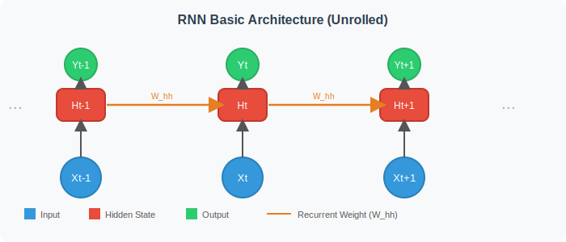
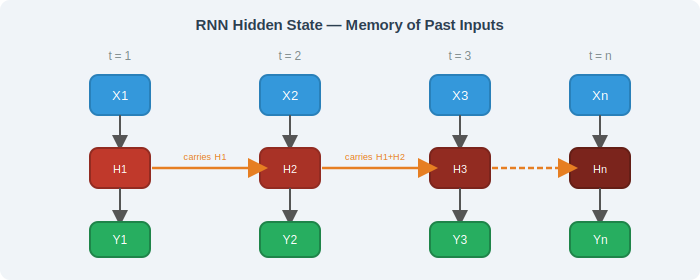
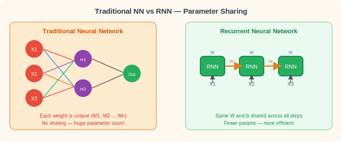
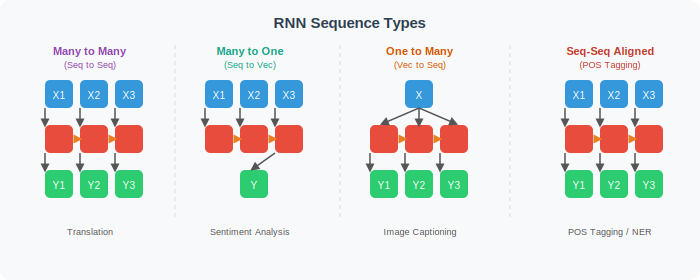
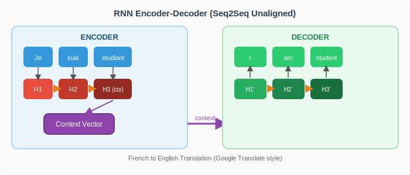

# Recurrent Neural Networks (RNN) — Complete Guide: Beginner to Advanced

> **How to read this guide:** Start at Part 1 if you're new to neural networks. Skip to Part 2 if you already understand feedforward networks. Jump to Part 4 for LSTM/GRU internals. Interview questions are at the end, organized by level.

---

## Table of Contents

1. [Foundation — Why RNNs Exist](#1-foundation--why-rnns-exist)
2. [Core RNN Architecture](#2-core-rnn-architecture)
3. [RNN Sequence Types and Applications](#3-rnn-sequence-types-and-applications)
4. [Advanced Variants — LSTM and GRU](#4-advanced-variants--lstm-and-gru)
5. [Training RNNs — BPTT and Vanishing Gradients](#5-training-rnns--bptt-and-vanishing-gradients)
6. [Bidirectional RNNs and Deep RNNs](#6-bidirectional-rnns-and-deep-rnns)
7. [Attention Mechanism — The Bridge to Transformers](#7-attention-mechanism--the-bridge-to-transformers)
8. [Real-World Applications Deep Dive](#8-real-world-applications-deep-dive)
9. [Interview Questions — Beginner to Advanced](#9-interview-questions--beginner-to-advanced)

---

## 1. Foundation — Why RNNs Exist

### 1.1 The Problem with Traditional Neural Networks on Sequences

A standard feedforward neural network (MLP) has a fundamental constraint: it requires **fixed-size inputs**. Every neuron in the input layer is wired to a specific named feature — `input₁ = age`, `input₂ = salary`, etc. The network's architecture is frozen at design time.

This breaks completely when your data is **sequential**:

| Problem | Why Traditional NN Fails |
|---|---|
| Sentences vary in word count | Network can't resize itself for each sentence |
| "Not good" vs "good" — same words, different order | No notion of position or order |
| "He said she loved him" — pronoun resolution | Needs memory of earlier words |
| Stock prices — today depends on yesterday | Cannot carry information across time |

**Think of it like Java:** A `String[]` has a fixed length declared at creation. But language is like a `List<String>` — it grows. Traditional NNs are `String[]`; RNNs are `List<String>` processing one element at a time with state carried between iterations.

### 1.2 The Three Core Problems RNNs Solve

**Problem 1 — Variable-length input:** RNNs process **one token at a time**, so the same network handles a 3-word sentence and a 300-word paragraph without any structural change.

**Problem 2 — No parameter sharing:** In a traditional NN, weights at position 1 are completely independent of weights at position 5. The word "bank" at position 1 and at position 10 require the network to re-learn the concept independently. RNNs use **the same weight matrix at every timestep** — what it learns about "bank" transfers everywhere in the sequence.

**Problem 3 — No memory:** Traditional NNs treat each input as independent. RNNs pass a **hidden state** from one timestep to the next — like a running notebook that accumulates context.

### 1.3 What Makes Data "Sequential"

Sequential data has two properties:
1. **Order matters** — shuffling the elements changes the meaning
2. **Context dependency** — the meaning of element N depends on elements before it

Examples of sequential data:
- **Text:** Words in a sentence — "not bad" ≠ "bad not"
- **Time series:** Stock prices, temperature, heartbeat signals
- **Audio:** Sound waves where each sample depends on prior samples
- **Video:** Frames where motion only makes sense over time
- **DNA:** Nucleotide sequences where gene expression depends on surrounding codons

---

## 2. Core RNN Architecture

### 2.1 The Recurrent Cell — The Core Idea

The fundamental equation of an RNN is:

```
hₜ = tanh(W_xh · xₜ  +  W_hh · hₜ₋₁  +  b)
yₜ = W_hy · hₜ  +  b_y
```

| Symbol | Meaning |
|---|---|
| `xₜ` | Input at timestep t (e.g., word embedding vector) |
| `hₜ` | Hidden state at timestep t — the "memory" |
| `hₜ₋₁` | Previous hidden state — what we remember |
| `W_xh` | Weight matrix: input → hidden |
| `W_hh` | Weight matrix: hidden → hidden (the recurrent weight) |
| `b` | Bias vector |
| `yₜ` | Output at timestep t |
| `tanh` | Activation function that squashes values to [-1, 1] |

**The key insight:** `W_xh`, `W_hh`, and `b` are the **same weights at every timestep**. The RNN is literally the same function applied repeatedly — like a `for` loop applying the same logic at each iteration but carrying a state variable (`hₜ`) between iterations.

```java
// Java analogy — this is conceptually what an RNN does
double[] h = new double[hiddenSize]; // initial hidden state = zeros

for (int t = 0; t < sequence.length; t++) {
    double[] x = sequence[t];                     // current input
    h = tanh(matMul(W_xh, x) + matMul(W_hh, h) + b);  // update state
    double[] y = matMul(W_hy, h) + b_y;           // produce output
}
```

### 2.2 Unrolled Architecture Diagram

The diagram below shows the RNN "unrolled" across time. Each column is one timestep. The orange arrows are the recurrent connections — the same `W_hh` weight passed forward.



### 2.3 Hidden State — The Memory Mechanism

The hidden state `hₜ` is the RNN's **working memory**. It's a fixed-size vector (e.g., 256 numbers) that carries forward a compressed summary of everything seen so far.

The color gradient below shows how each hidden state accumulates more history:



**Key observations from the diagram:**
- `H₁` only knows `X₁`
- `H₂` knows `X₁` and `X₂` (via `H₁`)
- `Hₙ` theoretically knows the entire sequence — but in practice, vanilla RNNs struggle to remember very early inputs (vanishing gradient problem — covered in Section 5)

### 2.4 Parameter Sharing — Why It Matters



**Concrete numbers to appreciate this:**
- A sentence with 50 words, each word as a 300-dim embedding
- Traditional NN input layer: `50 × 300 = 15,000` input neurons → massive parameter explosion
- RNN: Still just `W_xh` (300 × hidden_size) + `W_hh` (hidden_size × hidden_size) — fixed regardless of sequence length

---

## 3. RNN Sequence Types and Applications

### 3.1 The Four Architectures at a Glance



### 3.2 Many-to-Many (Seq → Seq Unaligned) — Encoder-Decoder

**Use cases:** Machine translation, time series forecasting (input 90 days → output 30 days), chatbot response generation, summarization.

The input sequence length and output sequence length are **different and not aligned**.



**How it works step by step:**
1. **Encoder** reads every word of the French sentence one by one, updating its hidden state
2. The **final encoder hidden state** becomes the "context vector" — a compressed representation of the entire input
3. **Decoder** receives the context vector as its initial hidden state
4. Decoder generates output tokens one by one, each output becoming the next input (autoregressive generation)
5. Decoder stops when it generates a special `<END>` token

**Weakness:** The entire input is compressed into one fixed-size context vector. For long sentences, this becomes a bottleneck — the encoder must fit everything into, say, 512 numbers. → This led to the **Attention Mechanism** (Section 7).

### 3.3 Many-to-One (Seq → Vec) — Sentiment Analysis

**Use cases:** Movie/product review sentiment, spam detection, document classification, fake news detection.

The entire input sequence is read, and only the **final hidden state** is used to make one prediction.

```
"The movie was absolutely terrible and boring" → [RNN] → hₙ → Dense → "Negative"
"Outstanding performance, loved every scene"   → [RNN] → hₙ → Dense → "Positive"
```

**Key point:** The final hidden state `hₙ` must contain everything relevant — the model learns to compress the entire sequence into a classification-useful representation.

### 3.4 One-to-Many (Vec → Seq) — Image Captioning

**Use cases:** Image captioning (CNN feature → descriptive sentence), music generation (seed note → melody), story generation from a theme vector.

```
[CNN encodes image] → feature_vector → [RNN decoder]
                                              ↓
                               "A dog" → "running" → "on" → "a" → "beach" → <END>
```

The initial vector seeds the hidden state. Then the decoder generates tokens autoregressively — each predicted word is fed as input to the next step.

### 3.5 Seq-to-Seq Aligned (Many-to-Many Synchronized)

**Use cases:** POS tagging, Named Entity Recognition (NER), chunking, slot filling in dialogue systems.

Every input token gets a corresponding output label at the same position:

```
Input:  "Tim   Cook  is   the   CEO   of    Apple"
Output: "PER   PER   O    O     TITLE PREP  ORG"
```

No encoder-decoder bottleneck — the RNN reads the full sequence and produces one output per position.

---

## 4. Advanced Variants — LSTM and GRU

### 4.1 The Vanishing Gradient Problem in Vanilla RNN

Before understanding LSTM/GRU, you must understand **why vanilla RNNs fail on long sequences.**

During backpropagation through time (BPTT), gradients are multiplied across every timestep. If the recurrent weight matrix `W_hh` has values slightly less than 1, after 50 steps:

```
gradient × 0.9⁵⁰ ≈ 0.005   → gradient vanishes → early inputs forgotten
gradient × 1.1⁵⁰ ≈ 117     → gradient explodes → unstable training
```

**Practical consequence:** A vanilla RNN cannot reliably learn dependencies longer than ~10-20 timesteps. For a paragraph-length input, it essentially forgets the beginning by the time it reaches the end.

### 4.2 LSTM — Long Short-Term Memory

LSTM (Hochreiter & Schmidhuber, 1997) solves the vanishing gradient problem by introducing a **cell state** `Cₜ` — a separate, protected memory lane that gradients can flow through without repeated multiplication.

An LSTM cell has **four** components:

#### The Four Gates of LSTM

**1. Forget Gate** — What should we erase from memory?
```
fₜ = σ(W_f · [hₜ₋₁, xₜ] + b_f)
```
Output ∈ [0, 1]: 0 = completely forget, 1 = completely keep.

**2. Input Gate** — What new information should we store?
```
iₜ = σ(W_i · [hₜ₋₁, xₜ] + b_i)      ← how much to write
C̃ₜ = tanh(W_C · [hₜ₋₁, xₜ] + b_C)   ← candidate values to write
```

**3. Cell State Update** — Update the memory:
```
Cₜ = fₜ ⊙ Cₜ₋₁  +  iₜ ⊙ C̃ₜ
```
`⊙` = element-wise multiplication. The forget gate erases, the input gate writes new info.

**4. Output Gate** — What do we read from memory?
```
oₜ = σ(W_o · [hₜ₋₁, xₜ] + b_o)
hₜ = oₜ ⊙ tanh(Cₜ)
```

**Why this works:** The cell state `Cₜ` flows across timesteps with only element-wise operations (no matrix multiplication). Gradients can flow backwards through the cell state with minimal decay — solving vanishing gradients.

**Java analogy:** Think of LSTM like a structured `HashMap` with TTL control:
- `fₜ` = deciding which keys to expire
- `iₜ + C̃ₜ` = writing new key-value pairs
- `oₜ` = deciding which values to read for the current computation
- `Cₜ` = the durable storage that persists

#### LSTM Summary Table

| Gate | Function | Analogy |
|---|---|---|
| Forget gate `fₜ` | Decide what to erase | Delete old notes |
| Input gate `iₜ` | Decide what to write | Highlight new info |
| Cell state `Cₜ` | The long-term memory | Notebook |
| Output gate `oₜ` | Decide what to expose | What to say now |
| Hidden state `hₜ` | Short-term working memory | What's in your head right now |

### 4.3 GRU — Gated Recurrent Unit

GRU (Cho et al., 2014) is a simplified version of LSTM that merges the cell state and hidden state, reducing the number of gates from 4 to 2.

**Reset Gate** — How much of the past to forget:
```
rₜ = σ(W_r · [hₜ₋₁, xₜ])
```

**Update Gate** — How much of the new candidate to use:
```
zₜ = σ(W_z · [hₜ₋₁, xₜ])
h̃ₜ = tanh(W · [rₜ ⊙ hₜ₋₁, xₜ])    ← candidate hidden state
hₜ = (1 - zₜ) ⊙ hₜ₋₁  +  zₜ ⊙ h̃ₜ  ← interpolate old and new
```

### 4.4 LSTM vs GRU — When to Use Which

| Factor | LSTM | GRU |
|---|---|---|
| Parameters | More (~4x vanilla RNN) | Fewer (~3x vanilla RNN) |
| Training speed | Slower | Faster |
| Long sequences | Better (separate cell state) | Slightly worse |
| Small datasets | Risk of overfitting | Better generalization |
| Complexity | Higher | Lower |
| **Rule of thumb** | Default for NLP tasks | Default for time series, small data |

---

## 5. Training RNNs — BPTT and Vanishing Gradients

### 5.1 Backpropagation Through Time (BPTT)

Training an RNN uses a modified form of backpropagation called **Backpropagation Through Time (BPTT)**. The process:

1. **Forward pass:** Run the RNN for T timesteps, compute loss at each step (or just the final step)
2. **Compute total loss:** `L = Σ Lₜ` for t = 1 to T
3. **Backward pass:** Unroll the gradient computation backwards through all T timesteps, accumulating gradients for `W_xh`, `W_hh`, `b`

The gradient of the loss with respect to `W_hh` involves a chain of matrix multiplications across T steps:

```
∂L/∂W_hh ∝ Πₜ (∂hₜ/∂hₜ₋₁) = Πₜ W_hh · diag(tanh'(·))
```

This product of T matrices causes gradients to either vanish (values < 1) or explode (values > 1).

### 5.2 Truncated BPTT

In practice, for very long sequences, we use **Truncated BPTT**: only backpropagate through a fixed window of `k` timesteps instead of the full sequence. This trades some learning quality for computational tractability.

### 5.3 Gradient Clipping

To handle **exploding gradients**, we clip the gradient norm:

```python
if gradient_norm > threshold:
    gradient = gradient * (threshold / gradient_norm)
```

This prevents the weights from taking catastrophically large update steps. Gradient clipping is a standard trick used in all production RNN training.

### 5.4 Summary of RNN Failure Modes

| Problem | Symptom | Solution |
|---|---|---|
| Vanishing gradient | Can't learn long-range deps | LSTM / GRU |
| Exploding gradient | Loss goes to NaN | Gradient clipping |
| Slow training | Long sequences → many sequential steps | Truncated BPTT |
| Cannot parallelize | Sequential by nature | Transformers (attention) |

---

## 6. Bidirectional RNNs and Deep RNNs

### 6.1 Bidirectional RNN

A standard RNN processes sequence from **left to right** — at timestep t, it can only see tokens 1 through t. But many tasks benefit from future context too.

**Example:** In POS tagging, "He can fish" — "can" is a verb. But "He bought a can" — "can" is a noun. You need future context to disambiguate.

A **Bidirectional RNN** runs two RNNs simultaneously:
- Forward RNN: processes left → right, produces `→hₜ`
- Backward RNN: processes right → left, produces `←hₜ`

The outputs are concatenated: `hₜ = [→hₜ ; ←hₜ]`

```
Input:    "He    can    fish"
Forward:  h₁→   h₂→   h₃→
Backward: ←h₁   ←h₂   ←h₃
Combined: [h₁→,←h₁]  [h₂→,←h₂]  [h₃→,←h₃]
```

**Limitation:** Bidirectional RNNs cannot be used for generation (you can't see the future if you're generating token by token). They're only usable for tasks where the full input is available — NER, classification, encoding.

### 6.2 Deep (Stacked) RNNs

Just as deep feedforward networks have multiple hidden layers, **stacked RNNs** pass the output of one RNN as the input to the next:

```
Input x
  → RNN Layer 1 → h¹ₜ
  → RNN Layer 2 → h²ₜ
  → RNN Layer 3 → h³ₜ
  → Output
```

Each layer learns increasingly abstract representations of the sequence. Deep RNNs generally outperform single-layer RNNs on complex tasks, at the cost of more parameters and slower training.

---

## 7. Attention Mechanism — The Bridge to Transformers

### 7.1 The Context Vector Bottleneck Problem

In the basic Encoder-Decoder architecture, the **entire input sentence is compressed into a single fixed-size context vector**. For long sentences (50+ words), this is like trying to summarize a book into a single sentence — you lose information.

Bahdanau et al. (2015) proposed **Attention**: instead of a single context vector, the decoder should be allowed to **look back at all encoder hidden states** and decide which to focus on at each generation step.

### 7.2 How Attention Works

At each decoder step t, the attention mechanism:

1. **Scores** each encoder hidden state against the current decoder state:
   ```
   eₜᵢ = score(hₜ_decoder, hᵢ_encoder)
   ```

2. **Normalizes** scores with softmax to get attention weights:
   ```
   αₜᵢ = softmax(eₜᵢ) → weights sum to 1
   ```

3. **Computes a weighted sum** of encoder states:
   ```
   context_t = Σᵢ αₜᵢ · hᵢ_encoder
   ```

4. **Decoder** uses `context_t` (not a single bottleneck vector) to generate the next word.

**Intuition:** When translating the word "étudiant" (student), the decoder's attention should focus heavily on the encoder hidden state for "étudiant" and less on "Je" and "suis". The model learns which source words to attend to for each target word.

### 7.3 From Attention to Transformers

Attention over RNN encoder states was so powerful that researchers asked: **what if we use attention everywhere and drop the RNN entirely?**

This led to the **Transformer** architecture (Vaswani et al., 2017), which:
- Replaces recurrence with self-attention (each position attends to all other positions)
- Is fully parallelizable (no sequential dependencies)
- Handles arbitrarily long dependencies equally well
- Powers GPT, BERT, and all modern LLMs

The learning path: **Vanilla RNN → LSTM → Attention+RNN → Transformer**

---

## 8. Real-World Applications Deep Dive

### 8.1 Stock Price Forecasting

**Problem type:** Many-to-Many or Many-to-One time series

**Architecture:**
- Input: past N days of OHLCV data (Open, High, Low, Close, Volume)
- Model: LSTM with 1-3 stacked layers
- Output: next day's closing price (regression) or next K days (seq-to-seq)

**Why LSTM over vanilla RNN:** Stock patterns can have weekly and monthly cycles — LSTM's long-term memory handles 30+ day dependencies.

**Common preprocessing:** MinMax scaling, creating sliding window sequences (window=60 days → predict day 61).

### 8.2 Google Translate — Neural Machine Translation

**Evolution:**
1. Rule-based (1970s-2000s): hand-crafted grammar rules
2. Statistical MT (2000s): phrase-based alignment
3. **RNN Seq2Seq (2014):** Sutskever et al. — end-to-end neural translation
4. **Attention (2015):** Bahdanau et al. — huge quality improvement
5. **Transformers (2017):** Google Brain — current state of the art

**Key challenge:** Languages have different word orders. German puts verbs at the end. Japanese structures sentences noun-verb-object with honorifics that have no English equivalent. The Seq2Seq + Attention model learns these structural mappings from millions of parallel sentence pairs.

### 8.3 Gmail Smart Compose (Text Autocomplete)

**Problem type:** Many-to-Many (language model, predicting next word)

Language modeling uses the **aligned Many-to-Many** structure — at each position, predict the next word:

```
Input:  "Thanks for your" → "email"
Input:  "I will be" → "there"
```

This is trained with the standard next-word prediction objective — the model sees all past words and must predict the immediate next word at every position.

### 8.4 Named Entity Recognition (NER)

**Problem type:** Seq-to-Seq Aligned (one label per token)

```
"Barack Obama was born in Hawaii"
  B-PER  I-PER   O   O    O   B-LOC
```

Typically implemented with **Bidirectional LSTM + CRF (Conditional Random Field)**:
- BiLSTM captures context from both directions
- CRF enforces label transition constraints (I-PER can't follow B-LOC)

---

## 9. Interview Questions — Beginner to Advanced

### Level 1 — Conceptual Understanding

**Q1: What is a Recurrent Neural Network and how does it differ from a feedforward network?**

> **Answer:** An RNN is a neural network designed for sequential data. Unlike feedforward networks, which process each input independently, RNNs maintain a **hidden state** that carries information from one timestep to the next. This gives the network a form of memory — the output at time t depends not only on the input at time t, but on all previous inputs. The same weights (`W_xh`, `W_hh`) are shared across all timesteps, making it naturally handle variable-length sequences.

---

**Q2: What is the hidden state in an RNN? What does it represent?**

> **Answer:** The hidden state `hₜ` is a fixed-size vector (e.g., 256 floating-point numbers) that serves as the RNN's working memory. It's computed at each timestep from the current input and the previous hidden state: `hₜ = tanh(W_xh·xₜ + W_hh·hₜ₋₁ + b)`. It represents a **compressed summary** of all inputs seen up to and including timestep t. Later timesteps inherit and refine this summary, making it an accumulation of sequential context.

---

**Q3: Name and explain the four types of RNN architectures.**

> **Answer:**
> - **Many-to-One (Seq→Vec):** Reads a full sequence, outputs a single value. Used in sentiment analysis, document classification.
> - **One-to-Many (Vec→Seq):** Takes a single input, generates a sequence. Used in image captioning, music generation.
> - **Many-to-Many Aligned:** One output per input, same length. Used in POS tagging, NER.
> - **Many-to-Many Unaligned (Seq2Seq):** Variable input and output lengths via encoder-decoder. Used in machine translation, summarization.

---

**Q4: Why can't a traditional neural network process variable-length sequences?**

> **Answer:** A feedforward neural network has a fixed input layer — the number of input neurons is set at design time, corresponding to a fixed number of named features. Sentences or time series vary in length, so using a fixed-size network requires either truncating longer inputs (losing information) or padding shorter inputs (introducing noise). Neither is satisfactory. RNNs solve this by processing **one element at a time** in a loop — the same cell handles any sequence length without architectural changes.

---

**Q5: What is parameter sharing in RNNs and why does it matter?**

> **Answer:** In an RNN, the same weight matrices `W_xh`, `W_hh`, and bias `b` are applied at **every timestep** — they're shared across the entire sequence. This means: (1) the parameter count is constant regardless of sequence length; (2) patterns learned at one position automatically transfer to all others; (3) the model is far more data-efficient than using unique weights per position. In contrast, a traditional NN with fixed inputs has independent weights per position, causing parameter explosion and position-sensitivity.

---

### Level 2 — Technical Understanding

**Q6: What is the vanishing gradient problem in RNNs? How do LSTMs solve it?**

> **Answer:** During BPTT, gradients are multiplied across T timesteps via the recurrent weight matrix. If eigenvalues of `W_hh` are < 1, the gradient shrinks exponentially with sequence length, causing early timesteps to contribute nothing to learning — the model can't capture long-range dependencies.
>
> LSTM solves this with a **cell state** `Cₜ` that flows through timesteps with only element-wise operations (no matrix multiplication). The forget gate `fₜ` can be set close to 1 to allow gradients to flow unobstructed over many timesteps — essentially creating a "gradient highway." This allows LSTMs to learn dependencies over 100+ timesteps reliably.

---

**Q7: Explain the gates of an LSTM. What does each gate do?**

> **Answer:**
> - **Forget gate** `fₜ = σ(...)`: Decides what fraction of the old cell state to erase. Values close to 0 = forget, close to 1 = retain.
> - **Input gate** `iₜ = σ(...)`: Controls how much of the new candidate information to write into the cell state.
> - **Candidate cell** `C̃ₜ = tanh(...)`: Proposes new values to potentially add to memory.
> - **Cell state update** `Cₜ = fₜ⊙Cₜ₋₁ + iₜ⊙C̃ₜ`: Performs the actual memory update — selectively erase and write.
> - **Output gate** `oₜ = σ(...)`: Determines what portion of the cell state to expose as the hidden state.

---

**Q8: What is BPTT (Backpropagation Through Time)?**

> **Answer:** BPTT is the algorithm for training RNNs. Since an RNN is a loop applied T times, it can be unrolled into a T-layer deep network where all layers share weights. Standard backpropagation is then applied to this unrolled graph. The key difference is that gradients from all timesteps are summed for each shared weight parameter. BPTT has time complexity O(T) and space complexity O(T) since all intermediate hidden states must be stored for the backward pass.

---

**Q9: What is Truncated BPTT and why is it used?**

> **Answer:** Full BPTT over a very long sequence (e.g., 10,000 timesteps) is computationally prohibitive — both in time (O(T) sequential operations) and memory (storing all hidden states). Truncated BPTT limits backpropagation to a fixed window of `k` timesteps. The forward pass continues normally across the full sequence, but gradients only flow back through the last k steps. This makes training feasible at the cost of not learning dependencies longer than k steps.

---

**Q10: What is the difference between LSTM and GRU? When would you choose one over the other?**

> **Answer:** Both LSTM and GRU address vanishing gradients, but differ in structure:
> - LSTM has a separate cell state and hidden state, with 4 gates (forget, input, candidate, output) — more expressive, more parameters.
> - GRU merges cell state and hidden state, uses only 2 gates (reset, update) — fewer parameters, faster to train.
>
> Choose LSTM when: you have abundant data, long sequences, or complex dependency patterns. Choose GRU when: data is limited, speed matters, or you're working with time series that have moderate-length dependencies. In practice, performance is often similar — GRU is the default for time series, LSTM for NLP.

---

**Q11: What is a Bidirectional RNN? When can and cannot it be used?**

> **Answer:** A Bidirectional RNN runs two RNNs on the input: one processes left-to-right (→h), one processes right-to-left (←h). The hidden states are concatenated at each position, giving each position access to both past and future context.
>
> **Can use:** Any task where the full input is known at inference time — NER, POS tagging, sentiment analysis, text encoding for translation.
>
> **Cannot use:** Autoregressive generation (language modeling, machine translation decoding) — you can't see future tokens when generating the current one.

---

### Level 3 — Advanced/System Design

**Q12: Explain the Encoder-Decoder architecture. What is the bottleneck limitation?**

> **Answer:** The Encoder-Decoder (Seq2Seq) model uses two RNNs. The encoder reads the full input sequence and compresses it into a single fixed-size **context vector** (its final hidden state). The decoder takes this context vector as its initial hidden state and generates the output sequence one token at a time.
>
> **Bottleneck limitation:** For long input sequences, all information must be compressed into one fixed-size vector (e.g., 512 numbers). This creates an information bottleneck — the encoder must discard details, and translation quality degrades with sentence length. This motivated the **Attention mechanism** (Bahdanau, 2015), which gives the decoder access to all encoder hidden states rather than just the final one.

---

**Q13: What is the Attention Mechanism? How does it improve over the basic Seq2Seq model?**

> **Answer:** Attention allows the decoder to **selectively focus on different encoder hidden states** at each generation step, rather than relying on a single bottleneck context vector.
>
> At decoder step t: (1) compute alignment scores between decoder state and each encoder state; (2) normalize with softmax to get attention weights α; (3) compute a weighted sum of all encoder states as the dynamic context vector; (4) use this context for next token generation.
>
> **Improvement:** The decoder can "look at" any part of the input when generating each output token. Translating the word "student" → the decoder attends heavily to the encoder state for "étudiant." This eliminates the information bottleneck and dramatically improves quality on long sentences.

---

**Q14: Why have Transformers largely replaced RNNs for NLP tasks?**

> **Answer:** RNNs have three fundamental limitations:
> 1. **Sequential computation:** Each step must wait for the previous — no parallelization across time. Training is slow.
> 2. **Vanishing gradients (even with LSTM):** Long-range dependencies are still challenging.
> 3. **Fixed memory size:** The hidden state is fixed-dimensional regardless of how much context is needed.
>
> Transformers use **self-attention** that: (1) computes all-to-all token relationships in parallel (O(1) sequential steps vs O(T) for RNN); (2) creates direct connections between any two positions in the sequence, regardless of distance; (3) scales better with more data and compute. However, RNNs still see use in streaming/real-time applications, resource-constrained deployments, and specific time series tasks.

---

**Q15: How would you design an RNN system to forecast the next 30 days of stock prices given 90 days of historical data?**

> **Answer:**
> **Data preparation:**
> - Normalize prices with MinMaxScaler (scale to [0,1])
> - Create input windows: each sample is 90 timesteps → 30 target timesteps
> - Features: close price, volume, moving averages, RSI — each as a separate feature dimension
>
> **Model architecture:**
> - 2-3 stacked LSTM layers (hidden_size=128 or 256) with dropout (0.2) between layers
> - Encoder reads 90-step input, Decoder generates 30-step output (Seq2Seq) OR single LSTM reads 90 steps and final hidden state feeds into a Dense(30) head for direct multi-step prediction
>
> **Training:**
> - Loss: MAE or MSE on the 30 predicted prices
> - Optimizer: Adam with learning rate decay
> - Gradient clipping (threshold=1.0) to prevent exploding gradients
>
> **Evaluation:**
> - RMSE, MAE, MAPE on holdout test set (time-series split — no random shuffle)
> - Baseline comparison: persistence model (predict "same as last 30 days")

---

**Q16: What is gradient clipping and why is it necessary for RNN training?**

> **Answer:** Gradient clipping limits the magnitude of gradients during backpropagation. The most common variant is **norm clipping**: if the global gradient norm exceeds a threshold (e.g., 5.0), all gradients are scaled down proportionally so the norm equals the threshold.
>
> It's necessary because RNNs suffer from **exploding gradients**: repeated multiplication by `W_hh` across many timesteps can cause gradient norms to grow exponentially. An extremely large gradient causes the optimizer to take a huge step, destroying previously learned weights. Gradient clipping acts as a safety valve — it prevents catastrophic weight updates while allowing normal gradient flow below the threshold.

---

**Q17: How does the context vector in Seq2Seq connect to modern embeddings like BERT?**

> **Answer:** The encoder's final hidden state (context vector) is conceptually similar to a **sentence embedding** — a dense numerical representation of the full input meaning. BERT takes this further: instead of one final vector, BERT produces a **contextual embedding for every token** using bidirectional self-attention across the full sequence. BERT's `[CLS]` token embedding is often used as a sentence-level representation — analogous to the Seq2Seq context vector, but richer because it's computed with full bidirectional context and is not limited by RNN sequential bottlenecks. The lineage is: RNN hidden state → Seq2Seq context vector → Attention context → BERT contextual embeddings.

---

## Quick Reference — Key Formulas

| Component | Formula |
|---|---|
| Vanilla RNN hidden state | `hₜ = tanh(W_xh·xₜ + W_hh·hₜ₋₁ + b)` |
| RNN output | `yₜ = W_hy·hₜ + b_y` |
| LSTM forget gate | `fₜ = σ(W_f·[hₜ₋₁, xₜ] + b_f)` |
| LSTM input gate | `iₜ = σ(W_i·[hₜ₋₁, xₜ] + b_i)` |
| LSTM cell state | `Cₜ = fₜ⊙Cₜ₋₁ + iₜ⊙tanh(W_C·[hₜ₋₁,xₜ]+b_C)` |
| LSTM output gate | `oₜ = σ(W_o·[hₜ₋₁, xₜ] + b_o)` |
| LSTM hidden state | `hₜ = oₜ⊙tanh(Cₜ)` |
| GRU update gate | `zₜ = σ(W_z·[hₜ₋₁, xₜ])` |
| GRU reset gate | `rₜ = σ(W_r·[hₜ₋₁, xₜ])` |
| GRU hidden state | `hₜ = (1-zₜ)⊙hₜ₋₁ + zₜ⊙tanh(W·[rₜ⊙hₜ₋₁, xₜ])` |
| Attention score | `eₜᵢ = score(hₜ_dec, hᵢ_enc)` |
| Attention weights | `αₜᵢ = exp(eₜᵢ) / Σⱼ exp(eₜⱼ)` |
| Attention context | `cₜ = Σᵢ αₜᵢ · hᵢ_enc` |

---

## Architecture Decision Guide

```
Is your data sequential?
    NO  → Use MLP / CNN
    YES ↓

Do you need to generate a sequence?
    YES → Is input a sequence too?
        YES → Seq2Seq Encoder-Decoder (translation, forecasting)
        NO  → One-to-Many (image captioning, music generation)
    NO  → Does each input token need its own output label?
        YES → Seq-to-Seq Aligned (NER, POS tagging)
        NO  → Many-to-One (sentiment, classification)

Do you have long sequences (>50 steps)?
    YES → Use LSTM or GRU (not vanilla RNN)

Do you need full bidirectional context?
    YES → Use Bidirectional LSTM/GRU
    (only if not doing autoregressive generation)

Is training speed / scale critical?
    YES → Consider Transformer instead of RNN
```

---

*Guide compiled from original RNN notes with SVG diagrams and interview prep additions. Diagrams are original illustrations embedded inline.*
